# 1. Jetson Nano Basic Lesson

## 1.1 Jetson Nano B01 Basic Lesson

### 1.1.1 Introduction to Jetson Nano

* **Introduction**

 **1. Introduction to Jetson Nano**

Jetson Nano takes the lead in the global visual computer technology field.

It is an embedded AI platform system designed for a new generation of autonomous machines by NVIDIA. NVIDIA is not only a game graphics card producer but also an AI computing company.

Jetson Nano is launched in 2019 GTC convention. Small but powerful.

Adopting quad-core 64-bit ARM CPU and a 128-core integrated NVIDA GPU, Jetson Nano is capable of floating-point operations up to 472 GFLOPS.
 Its performance and energy efficiency make it possible for Jetson Nano to run modern AI loads, run multiple neural network in parallel, and process the data from multiple HD sensors simultaneously. It is widely applicable in image sorting, object detection, image segmentation, speech processing, etc. It also supports some common AI frameworks, which enables the developers to integrate their favorite models and frameworks to the products.

**2. Jetson Nano B01Introduction**

Jetson Nano B01 version is launched by NVIDIA in January 2020. Compared to the previous version, a CSI camera interface is a new added hardware.


* **Usage Guide**

The Jetson Nano B01 board can be powered using a 5V 4A DC power adapter.

> [!Note]
>
> * **when supplying power, please prevent short-circuiting from contacting with screwdriver or other metal conductive objects.**
> * **Please handle Jetson Nano B01 with care to avoid components damage caused by hitting.**

* **Hardware Components**

The following figure shows the hardware component of Jetson Nano B01.


① MicroSD card slot for main storage 

② 40-pin expansion header 

③ Micro-USB port for 5V power input, or for Device Mode 

④ Gigabit Ethernet port 

⑤ USB 3.0 ports ( ×4) 

⑥ HDMI output port 

⑦ Display Port connector 

⑧ DC Barrel Jack for 5V power input 

⑨ MIPI CSI-2 camera connectors


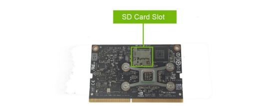

The function explanation of some of interfaces:

<table class="docutils-nobg" border="1">
<colgroup>
<col style="width: 35%" />
<col style="width: 64%" />
</colgroup>
<tbody>
<tr>
<td>
<p><strong>Port/Pin</strong></p>
</td>
<td>
<p><strong>Function</strong></p>
</td>
</tr>
<tr>
<td>
<p>2-channel MPI CSI interface port</p>
</td>
<td>
<p>Connect camera</p>
</td>
</tr>
<tr>
<td>
<p>Display port</p>
</td>
<td rowspan="2">
<p>Connect monitor</p>
</td>
</tr>
<tr>
<td>
<p>HDMI output port</p>
</td>
</tr>
<tr>
<td>
<p>DC power interface</p>
</td>
<td>
<p>5V power input</p>
</td>
</tr>
<tr>
<td>
<p>Power switch</p>
</td>
<td>
<p>Turn off the power</p>
</td>
</tr>
<tr>
<td>
<p>4-channel USB 3.2 Gen1 port</p>
</td>
<td>
<p>Used to connect peripherals and the</p>
<p>maximum transmission speed is up to 5Gb ps.</p>
</td>
</tr>
<tr>
<td>
<p>Gigabit Ethernet port</p>
</td>
<td style="text-align: left;">
<p>10/100/Base-T self-adaptive. PoE power supply is supported when connecting with PoE module.</p>
<p>" 10/100/1000Base-T" means Ethernet over twisted pair carrying 10Mb/s, 100Mb/s or 1000Mb/s baseband signals.</p>
</td>
</tr>
<tr>
<td>
<p>Micro USB interface</p>
</td>
<td>
<p>5V power input or USB data transfer.</p>
</td>
</tr>
<tr>
<td>
<p>Main memory SD card slot</p>
</td>
<td>
<p>Use an SD card as system boot disk.</p>
</td>
</tr>
<tr>
<td>
<p>M.2 Key E port</p>
</td>
<td>
<p>Connect with wireless network card.</p>
</td>
</tr>
<tr>
<td>
<p>PoE pin</p>
</td>
<td>
<p>Connect with PoE module.</p>
</td>
</tr>
<tr>
<td>
<p>GPIO port</p>
</td>
<td>
<p>For extension</p>
</td>
</tr>
<tr>
<td>
<p>Fan port</p>
</td>
<td>
<p>Connect with cooling fan</p>
</td>
</tr>
</tbody>
</table>

**4. Jetson Nano B01 Specification**

<table class="docutils-nobg" border="1">
<colgroup>
<col style="width: 35%" />
<col style="width: 64%" />
</colgroup>
<tbody>
<tr>
<td>
<p><strong>Parameter Name</strong></p>
</td>
<td>
<p><strong>Instruction</strong></p>
</td>
</tr>
<tr>
<td>
<p>GPU</p>
</td>
<td>
<p>NVIDIA Maxwell™ architecture. Equipped with 128 NVIDIA CUDA® cores</p>
</td>
</tr>
<tr>
<td>
<p>CPU</p>
</td>
<td>
<p>Quad-core ARM® Cortex®-A57 MPCore processor</p>
</td>
</tr>
<tr>
<td>
<p>RAM</p>
</td>
<td>
<p>4GB 64-bit LPDDR4</p>
</td>
</tr>
<tr>
<td>
<p>Storage</p>
</td>
<td>
<p>Micro SD card slot. You need to purchase SD over 16G.</p>
</td>
</tr>
<tr>
<td>
<p>Video encoding</p>
</td>
<td>
<p>4K @ 30/60 (H.264/H.265)。</p>
</td>
</tr>
<tr>
<td>
<p>Camera</p>
</td>
<td>
<p>12 channels (3x4 or 4x2) MIPI CSI-2 DPHY</p>
<p>1.1 (1.5 Gbps)</p>
</td>
</tr>
<tr>
<td>
<p>Connection</p>
</td>
<td>
<p>gigabit Ethernet</p>
</td>
</tr>
<tr>
<td>
<p>Display</p>
</td>
<td>
<p>HDMI 2.0 or DP1.2 | eDP 1.4 | DSI (1 x2) 2</p>
</td>
</tr>
<tr>
<td>
<p>UPHY</p>
</td>
<td>
<p>1 x1/2/4 PCIE 、1x USB 3.0、3x USB 2.0。</p>
</td>
</tr>
<tr>
<td>
<p>I/O</p>
</td>
<td>
<p>1x SDIO/2x SPI/4x I2C/2x I2S/GPIO。</p>
</td>
</tr>
</tbody>
</table>

### 1.1.2 TF Card Writing Image

* **Preparation**

Since Jetson Nano B01 has no internal memory, you need to burn the corresponding image with SD card before use, and insert it into the main memory SD card slot in order to boot up and use it normally.

The official OS image of Jetson Nano is an Ubuntu system which is an img file and needs to be written directly to the SD card.

Please prepare the following hardware and software:

1. Card reader

2. SD card

3. BalenaEtcher (image writing tool)


* **Image Preparation**

The image file is store under the same folder of this file. Extract the file in English path. If you want to download other versions of image, please find in this website: <https://developer.nvidia.com/jetpack-sdk-46>.

* **Write Image**

1. After the image file is decompressed, prepare a card reader and SD card.

Insert SD card into card reader, and connect it to computer. Then open "**balenaEtcher**".


2. Click "**Flash from file**" to import the image file.


3. Click "**Select target**" to select SD card.


> [!Note]
>
> **SD card will be formatted automatically when the image is written. Please make a copy of the import data before re-writing the image.**

4. Check the SD card to be written, and click "**Select**" .

5. Click "**Flash**" to start writing image.


6. If the formatting prompt appears after the image is written, please click "**Cancel**".


7. When the word "**Flash Complete**" is prompted, the image is written successfully.


### 1.1.3 First Start Jetson Nano

When first boot up Jetson Nano board, the system needs to be configured.

* **Hardware Preparation**

1. Jetson Nano board

2. 5V 4A DC power adapter

3. monitor, mouse and keyboard

* **Power on Jetson Nano**

1. Insert SD card (the system image is written) into Jetson Nano board. The SD card slot is shown in the picture below:

(Regarding system image writing, please refer to the material in " **[1.1 Jetson Nano B01 Usage/ 1.1.2 TF Card Writing Image]()**" .)


2. Please pay attention to the direction of SD card. The side with card slot must face upwards and push it into Jetson Nano board gently.


3. Connect monitor, mouse and keyboard to Jetson Nano board. Use HDMI cable to connect monitor to HDMI port of Jetson Nano board. Mouse and keyboard are connected to USB port, and 5V 4A power adapter to DC power port. Lastly, boot up Jetson Nano board after the network is connected.


* **System Configuration**

The system needs to be configured when first start Jetson Nano. The operation steps are as follow:

1. Accept the agreement license and click "**Continue**" .


2. Set system language and click "**Continue**" .


3. Set your location and click "**Continue**" .

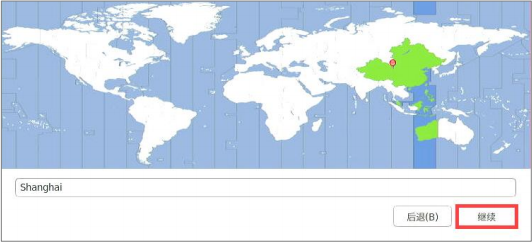

4) Set user name and password, and click "**Continue**" .


5. Keep the default size setting of APP partition, and click "**Continue**" .


6. Keep the default mode setting and click "**Continue**" .


7. After system configuration is complete, Jetson Nano board will restart automatically.


8. Enter the password set in step 4, and click "**Sign In**" to enter the system desktop.


9. Click on  and select "**System Settings...**" to enter the setting interface.


10. Select "**User Accounts**" .


11. Click onand input password. Then press Enter.


12. Switch "**Automatic Login**" to "**ON**" . Then exit settings.


13. After the first use of Jetson board, it can be directly controlled via remote tool. For the remote control, please refer to the material in " **[1.1.7 Remote Desktop Configuration and Usage](#anchor_1_1_7)**".

### 1.1.4 Jetson Nano System and Desktop Introduction

* **Introduction to Jetson Nano System**

Jetson Nano is a GPU processor-based embed development board developed by NVIDIA.

The system of Jetson Nano is customized based on Ubuntu18.04, and the basic operation is the same as general Ubuntu system. Support the prevalent AI frameworks and algorithms such as TensorFlow. Caffe/Caffer, PyTorchand keras. It also includes OpenGL, OpenCV and other GPU runtime environments as well as the corresponding call interfaces.

* **Introduction to System Desktop**

The following picture shows the Jetson Nano system desktop:


**1. Task bar**

<table class="docutils-nobg" border="1">
<colgroup>
<col style="width: 14%" />
<col style="width: 28%" />
<col style="width: 57%" />
</colgroup>
<tbody>
<tr>
<td>
<p><strong>Icon</strong></p>
</td>
<td>
<p><strong>Name</strong></p>
</td>
<td>
<p><strong>Function</strong></p>
</td>
</tr>
<tr>
<td></td>
<td>
<p>Search your</p>
<p>computer</p>
</td>
<td>
<p>Search application and file in system</p>
</td>
</tr>
<tr>
<td></td>
<td>
<p>Files</p>
</td>
<td>
<p>File manger</p>
</td>
</tr>
<tr>
<td></td>
<td>
<p>LibreOffice Writer</p>
</td>
<td>
<p>Create word file</p>
</td>
</tr>
<tr>
<td></td>
<td>
<p>LibreOffice Calc</p>
</td>
<td>
<p>Create spreadsheet</p>
</td>
</tr>
<tr>
<td></td>
<td>
<p>LibreOffice</p>
<p>Impress</p>
</td>
<td>
<p>Create presentation file</p>
</td>
</tr>
<tr>
<td></td>
<td>
<p>Software</p>
</td>
<td>
<p>App store</p>
</td>
</tr>
<tr>
<td></td>
<td>
<p>System Settings</p>
</td>
<td>
<p>common system settings</p>
</td>
</tr>
<tr>
<td></td>
<td>
<p>L4T-README</p>
</td>
<td>
<p>Open the folder where the instruction file is stored</p>
</td>
</tr>
<tr>
<td></td>
<td>
<p>Trash</p>
</td>
<td>
<p>Store the deleted files.</p>
</td>
</tr>
</tbody>
</table>

**2. Menu bar**

<table class="docutils-nobg" border="1">
<colgroup>
<col style="width: 25%" />
<col style="width: 74%" />
</colgroup>
<tbody>
<tr>
<td>
<p><strong>Icon</strong></p>
</td>
<td>
<p><strong>Function</strong></p>
</td>
</tr>
<tr>
<td></td>
<td>
<p>Related device settings</p>
</td>
</tr>
<tr>
<td></td>
<td>
<p>Network settings</p>
</td>
</tr>
<tr>
<td></td>
<td>
<p>Input method</p>
</td>
</tr>
<tr>
<td></td>
<td>
<p>System notification</p>
</td>
</tr>
<tr>
<td></td>
<td>
<p>Speaker volume</p>
</td>
</tr>
<tr>
<td></td>
<td>
<p>System time</p>
</td>
</tr>
<tr>
<td></td>
<td>
<p>System control menu</p>
</td>
</tr>
</tbody>
</table>

 **3. Desktop Application**

<table class="docutils-nobg" border="1">
<colgroup>
<col style="width: 14%" />
<col style="width: 28%" />
<col style="width: 57%" />
</colgroup>
<tbody>
<tr>
<td>
<p><strong>Icon</strong></p>
</td>
<td>
<p><strong>Name</strong></p>
</td>
<td>
<p><strong>Instruction</strong></p>
</td>
</tr>
<tr>
<td></td>
<td>
<p>Chromium browser</p>
</td>
<td>
<p>A browser is developed by Google</p>
</td>
</tr>
<tr>
<td></td>
<td>
<p>NVIDIA Jetson Developer Zone</p>
</td>
<td>
<p>Access NVIDA Jetson developer zone.</p>
</td>
</tr>
<tr>
<td></td>
<td>
<p>NVIDIA Jetson Support Forums</p>
</td>
<td>
<p>Access NVIDIA Jetson technical support forum.</p>
</td>
</tr>
<tr>
<td></td>
<td>
<p>NVIDIA Jetson Zoo</p>
</td>
<td>
<p>Access a web page for installation</p>
<p>instruction. This web page provides the instruction regarding how to install open source add-on packs and frameworks on Jetson Nano.</p>
</td>
</tr>
<tr>
<td></td>
<td>
<p>L4T-README</p>
</td>
<td>
<p>Access the specified folder. This folder stores instructions.</p>
</td>
</tr>
<tr>
<td></td>
<td>
<p>NVIDIA Jetson</p>
<p>Community</p>
<p>Projects</p>
</td>
<td>
<p>Access NVIDIA Jetson project forum</p>
</td>
</tr>
<tr>
<td></td>
<td>
<p>Terminal</p>
</td>
<td>
<p>Enter command in terminal to control system</p>
</td>
</tr>
</tbody>
</table>

<p id="anchor_1_1_5"></p>

### 1.1.5 Network Configuration (Wired and Wireless)

* **Preface**

>[!Note]
>
>**This lesson is suitable for both Jetson Nano B01 and Jetson Nano ALT. When installing wireless network card, please handle Jetson Nano with care and do not connect the port forcibly.**

Network is required for Jetson Nano to perform more operations. This lesson will introduce three network connection methods.

Wired network: connect Ethernet cable to RJ45 port of Jetson Nano to realize network connection.

Wireless network: install wireless network card on Jetson Nano to realize WIFI network connection.

 **1. RJ45**

RJ45 connector is a standardized telecommunication network interface with 8 -position for connecting hardware. There are two common types of RJ45

interfaces: DTE type is used for Ethernet network card, router Ethernet

interface, etc. DCE type is used for switch, etc. RJ45 interface supports 10M, 100M, and 1000M three rates, rate / duplex mode of auto-negotiation function.

**2. Wireless Network Card**

Wireless network card is a wireless terminal device, which is used to connect to the Internet through a wireless connection within the wireless coverage of a wireless local area network.

* **Wired Connection**

**1. Wiring**

>[!Note]
> 
> **It is recommend to use network cable for Jetson Nano development to ensure a stable network environment.**

1. Connect network cable to RJ45 interface, as the picture shown below:


2. If the interface flashes yellow light, as the picture shown below, which means network is connected successfully.


**2. Detect Connection Status**

1. Start Jetson Nano and connect it with screen.

>[!Note]
>
> For remote desktop installation and configuration, please refer to the material in " [**1.1.7 Remote Desktop Configuration and Usage**](#anchor_1_1_7)".
>

2. Double click to on system desktop to open the command line terminal.

3. Enter command "**ifconfig**" and press Enter to view the network connection status, If the IP of eth0 is 192.168.11.200 (this IP address is an example), network is connected successfully.

>[!Note]
>
>**The IP of eth0 will change with the router connected. The router needs to enable dhcp server function. Under normal circumstance, no need to manually enable dhcp service.**


* **Wireless Connection**

**1. Install Wireless Network Card**

>[!Note]
>
>**M2 wireless network card is applied in here. If you do not purchase Jetson Nano WIFI advanced kit, you can skip following part.**

1. Prepara Jetson Nano board, screwdriver, network card and antenna.

2. As the picture shown below, remove these two screws.


3. Open the two clips where the below red arrows point to.


4. Pull up the core board towards the red arrow.


5. Remove the screw for fixing network card, as the picture show below:


6. Insert network card to the position framed in following picture.


7. Tighten the screw for fixing network card, as the picture shown below:


8. There are two boxes in following picture. The red one is hole 1, and the blue one is hole 2 for connecting with antenna.


9. The antenna has two sides, as the picture shown below. The blue box shows the reverse side and the red box is the front side. You need to connect the reverse side in the corresponding position.


10. After installing antennas, the wire connected to hole 1 needs to be placed in the left side, and the wire to hole 2 needs to be placed in the right side.

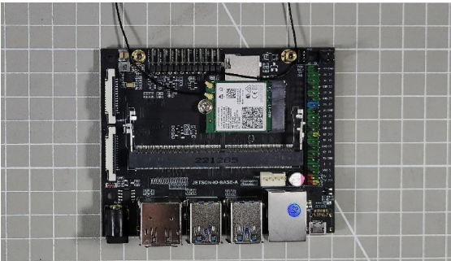

11. Then insert the core board to the position shown in the picture below:


12. Tighten the screws for fixing core board.


13. Fix the antenna to the cable connected to the network card.


 **2. Connection**

1. Start Jetson Nano and connect with touch screen. 

2. Click onand select "**More networks**" to select the WIFI to be connected.

3. Enter WIFI password and click "**Connect**" .


4. The following prompt will remind you WIFI is connected.


 **3. Detect Connection Status**

Enter command "**ifconfig**" and press Enter to view the network connection status. If the IP of wlan0 " 192.168.11.209" appears, network is connected successfully.

>[!Note]
>
>**The IP of wlan0 will change with the router connected. The router needs to enable dhcp server function. Under normal circumstance, no need to manually enable dhcp service.**
>


* **Connect Jetson Nano with USB Cable**

>[!Note]
>
>**If LAN is not connected to a public network, Jetson Nano will still not be able to access external resources.**
>
>**In addition, before connecting with USB cable, please first connect Jetson Nono to the power supply and waif for booting up.**

**1. Wiring**

1. Turn on Jetson Nano. Connect USB cable to the position shown in following picture and connect the other end to computer.


**2. View Device**

1. Boot up Jetson Nano board, right click on "**This computer**" to select "**Mange**" .


2. Click "**Device manger**". If you find "**Remote NDIS Compatible Device**", which means device is connected.


**3. View Device IP**

1. Right click network connection area and select "Open 'Network and Internet' settings" .


2. Click "**Change adapter**" to view adaptor.


3. The one in following red box is the required adapter.


4. Right click "**Status**".


5. Click "**Detailed Information**" .


6. If the information shown in below red box appears, it means Jetson Nano can be accessed through " **192.168.55.1**".


### 1.1.6 SSH Remote Connection

* **SSH Introduction**

SSH is a network protocol (the default port number is 22) used for encrypted login between computers and remote control via command line. Jetson Nano system has SSH service enabled by default, so you can use SSH login directly as long as the network connection is normal.

* **Preparation**

1. Refer to "**[1.1.5 Network Configuration](#anchor_1_1_5)**" to complete network connection.

2. MobaXterm tool (remote connection tool. Please find it under the same directory with this document and install.)


* **Connection**

**1. IP Search**

**Reminder:** if you use USB cable to connect Jetson Nano, the fixed IP is "**192.168.55.1**", you can skio this part.

1. After connecting the Jetson Nano board to the router via wireless or wired either way, the device IP can be queried through the router or MobaXterm tool.

2. If you use MobaXterm, please open tool first and follow the operation steps shown in the picture below.


3. IP address range is the possible address range of Jetson nano, generally fill in the first three input boxes with the same value as the computer IP, the last two are fixed to 1-\254. then click "**Start scan**" to search for all active IPs in the network.


4. As shown above, at the SSH column, the devices circled in green support SSH remote connection, from which you can find out your Jetson Nano device and can choose to record the IP.


**2. Create Session and Connection**

1. In MobaXterm, click "**Session**" at the upper right corner to create a session to record the IP of Jetson Nano " **192.168.11.161**", and click "**OK**" .


>[!Note]
>If you connect Jetson Nano with USB cable, you need to enter " **192.168.55.1**".


2. Enter user name and password. (The default setting is "**hiwonder**" as user name and "**hiwonder**" as password. You can modify it as needed.) Then press Enter. Please note that the password is the same as that in Linux.


>[!Note]
>
>**User name must be entered under lowercase mode when logging in, even if the set user name contains uppercase.**

After the password is input correctly, you will access to system successfully, as the figure shown below:


<p id="anchor_1_1_7"></p>

### 1.1.7 Remote Desktop Configuration and Usage

This lesson will explain how to remote access Jetson Nano through Nomachine.

>[!Note]
>
>**Before this lesson, please refer to "[1.1.5 Network Configuration](#anchor_1_1_5)" to connect network.**

* **Nomachine Introduction**

Nomachine allows user to remotely access Windows, Linux PC or other devices from another computer to complete differents tasks.

It is a remote desktop technology, which adopts a new remote protocol, extracts the data form desktop and transmits only some of parameters, and encrypts the data transmission through SSH, so it has a fast speed and high security performance compared to VNC or direct XDMP.

* **Install Nomachine on Computer**

1. Nomachine Tool. (remote desktop connection tool which can find it under the same directory with document.)


2. Double click "**[nomachine_7.1.3_1.exe](https://drive.google.com/drive/folders/15qZCvJvIb5HiTKk-u5BmBC_arG5I-P_U?usp=sharing)**" to open Nomachine installation package.

3. Click "**Next**".


4. Select installation language as "**English**". Check "**I accept the agreement**" and click "**Next**" .


5. Keep the default installation path and click "**Next**" .


6. After the following prompt appears, click "**Finish**" .


7. Click "**Yes**" to restart your computer. (**Do not skip this step!**)


* **Install Nomachine on Jetson Nano**

1. Start Jetson Nano. Open browser and open the website "[**https://www.nomachine.com/download**](https://www.nomachine.com/download)" to enter Nomachine download page. (If you use network card or network cable, you can directly enter the web page. If you use USB cable to connect Jetson Nano and computer, please refer to the following operation steps.)

2. Find "[**NoMachine for ARM**](https://downloads.nomachine.com/linux/?id=30&distro=Arm)" in page and click it to enter ARN version download page.


3. Then click "**NoMachine for ARM ARMv8 DEB**" to enter the download

page.


4. Click "**Download**" .


5. Drag this file in download directory to "**Home**" directory.


6. Find file "**[nomachine_8.1.2_1_arm64.deb](https://drive.google.com/drive/folders/15qZCvJvIb5HiTKk-u5BmBC_arG5I-P_U?usp=sharing)**" in the same path of this document.


7. Connect Jetson Nano on MobaXterm. Drag the file"**nomachine_8.1.2_1_arm64.deb**" to the position shown in the following red box.


8. On Jetson Nano desktop, you can find "**nomachine_8.1.2_1_arm64.deb**" under Home directory.


9) In "**Home**" directory, right click a blank space and select "**Open in Terminal**" .


10) Enter command "**sudo dpkg -i nomachine_8.1.2_1_arm64.deb**" . In command, "**nomachine_8.1.2_1_arm64.deb**" is the default file name. If it is modified when download, the file name in command must be modified according to the actual situation.

```
sudo dpkg -i nomachine_8.1.2_1_arm64.deb
```

11) Enter the password and press Enter. Here take the default password "**hiwonder**" as example.

* **Computer Connection and Usage**

1) After installation is complete, open Nomachine and click "**Settings**" to enter the setting page.


2) Click "**Ports**" to enter the port setting page.


3) Confirm the following two options are ticked. Then complete configuration.


4) Open Nomachine on computer and enter IP address " **192.168.43.47**" in

search box and click "**Connect to new host 192.168.43.47**" .


5) Enter username and password and click "**Login**" . Then you can find the Jetson Nano desktop.


* **Modify Solution**

After entering Jetson Nano system, adjust the resolution to enable the resolution is the same as the resolution of the PC.

1) Double clickto open the command line terminal.

2) Enter command "**xrandr --fb 1920x1080**" and press Enter to modify solution. Take the resolution "**1920\*1080**" as example. 

>[!Note]
>
>**When modify the resolution, do not connect with screen. Otherwise, the display problem will occur.** 


3) Open Nomahcine again.

* **Q&A**

1) **Black Screen**

If Jetson Nano does not enable auto-login, black screen will occur when using Nomachine.

Use a monitor to connect Jetson Nano board, For auto-login setting, please refer to Step 9-13 in "[ **1.1 Jetson Nano B01/ 1.1.3 First Start Jetson Nano/ System Configuration**]()" in material "[**1.1 Jetson Nano B01/ 1.1.3 First Start Jetson Nano**]()" .

2) **Blank Screen**

If there is no operation for a long time after connecting NoMachine, blank screen will occur when reopen Nomachine.

1) Close the current connection interface

2) Reconnect Jetson Nano and enter password to access desktop.


### 1.1.8 SSH File Transfer

* **Realization Goal**

Realize file transfer between computer and Jetson Nano board through SSH.

* **Transfer File via SSH**

**1. From Computer to Jetson Nano**

1) After SSH is connected, select the files to be transferred, drag the files to MobaXterm file zone with your mouse.


2) The file will automatically be transferred to Jetson Nano system desktop.Enter command "**ls**" to view all files.


 **2. From Jetson Nano to Computer**


After SSH is connected, find the file to be transferred on MobaXterm file zone, and drag file to computer desktop.


### 1.1.9 U disk Usage and Auto Mount

* **U Disk Usage Introduction**

The Jetson Nano B01 has no internal memory, while the Jetson Nano ALT has a built-in 16GB eMMC. Both can be expanded using an SD card. Besides,

capacity can also be expanded by mountong the U disk in the system directory.

Please prepare a U disk in advance. U disk will be formatted during operation so you need to make a copy of data in U disk as backup.

* **Mount U Disk**

1) Start Jetson Nano and connect to a USB port of Jetson Nano board, 

2) Double click onto open a command line terminal.

3) Enter command"**sudo mkfs.ext4 /dev/sda1**" and press Enter to format U disk.

```
sudo mkfs.ext4 /dev/sda1
```

4) If the following prompt appear, enter "**y**" and press Enter to confirm operation.


5) The below prompt means U disk is formatted successfully.


6) Then enter command "**sudo mount /dev/sda1 /mnt**" to mount U disk to "**/mnt**" directory which can be modify to other existed directory.

```
sudo mount /dev/sda1 /mnt
```

7) Lastly, enter command "**df -h**" to view whether the mounting is completed.

```
df -h
```

8) If the following prompt appears, the mounting is completed successfully.


* **Auto-mount after Booting up**
* 
After a manual mount, a system reboot will cause the mount to fail and require another mount. To avoid this, you can modify the file under the system path "**/etc/fstab**", which is used to store the static information of the file system.

When the system starts up, it will automatically read the information from this file, and will automatically mount the file system specified in this file to the specified directory, completing the function of automatic mounting on boot, as follows.

1) Start Jetson Nano board, insert U disk to one of USB ports of Jetson Nano.

2) Double click to open a command line terminal.

3) Enter command "**sudo vim /etc/fstab**" to edit fstab file.

```
sudo vim /etc/fstab
```

4) Press "**i**" key to start editing mode. In the corresponding position of the file, enter command "**/dev/sda1/mnt ntfs defaults 0 0**" which mush align with the previous line.


The input content correspond to six categories in the file. `file system` is the partition or storage to be mounted. `type` is the file system type of the device or partition to be mounted. `options` is the parameter to be used when mounting. `dump` is whether to back up the system file, 0 is ignored, 1 is backed up. `pass` is the retrieval sequence of file system, o for ignore, 1 for priority retrieval (usually the root directory), 2 for non-priority retrieval.

5) After confirming, press "**Esc**", enter " **:wq**" and press Enter to save and exit the file.


6) Enter command "**sudo mount -a**" to verify the editing content.

```
sudo mount -a
```

7) Lastly, enter command "**df -h**" to check whether the mounting is completed successfully.


<p id="anchor_1_1_10"></p>

### 1.1.10 Set Development Environment

Use SDK Manager tool in the virtual machine to install system image on SD card. This lesson will guide you how to install the virtual machine software.

* **Install Virtual Machine**

The installation pack of VMware Workstation Pro is located in "[**Appendix**]()".

The specific operation steps are as follow:

1) Extract "[**Vmware 16.0 Pro.zip**]()" to any directory, and then install the program "**VMware-workstation-full-16.0.0-16894299.exe**".

2) Click "**Next**".


3) Check "**I accept the terms in the License Agreement**" and click "**Next**".


4) If you need to change the installation path, please click "**Change**". After the path is confirmed, click "**Next**".


5) It is recommended to cancel the below two options and click "**Next**".


6) Keep the default settings and click "**Next**".


7) Click "**Install**".


8) After the installation is completed, click "**License**".


9) Open the file "**VMware 16 Activation Key. txt**" in the directory where the "**Wmware 16.0 Pro.zip**" software is extracted.

10) Copy any activation key. Go back to the installation page of the virtual machine, and paste it into the text box. Then click "**Enter**".


11) Click "**Finish**".


* **Create a Virtual Machine**

We will use Ubuntu 18.04 system in here and the system image file is located in "**[Appendix]()**".

The operation steps for creating a virtual machine is as follow：

1) Click on to open the virtual machine.

2) Click "**Create a New Virtual Machine**".


3) Keep the default settings and click **"Next**".


4) Click "**Browse**" and select Ubuntu180=0.4 image file, and click "**Next**".


5) Fill in your account information and click "**Next**".


6) You can change the name and the installation path of virtual machine, and then click "**Next**".


>[!Note]
>
>  **It is recommended to store on a disk with sufficient capacity.**

7) As the system image for the development kit will require a certain amount of disk space, we will set the disk size to 100GB. After the settings is finished, click "**Next**".


8) Click "**Finish**".  


9) After the virtual machine is installed, click the orange box in system interface.


10) Enter your password and click "**Sign In**" to enter the system desktop.


### 1.1.11 Burn System Image

You can use SDK Manager tool on virtual machine to burn the system image to SD card. This lesson primarily illustrates how to install and use SDK Manager tool on virtual machine.

* **Hardware Preparation**

1) Jetson Nano B01 board

2) 5v 4A power adapter

3) Wire jumper and dupond wire

4) USB cable

5) Monitor, mouse, and keyboard

* **Software Preparation**

**1. Virtual Machine Configuration**

Install VMware Workstation Pro on your computer and create the virtual machine. For the specific operation steps, please refer to "**[1.1.10 Set Development Environment](#anchor_1_1_10)**".

**2. Sign up NVIDIA DEVELOPER**

As NVIDIA DEVELOPER website is required to be login when using SDK Manager tool. Please sign up in advanced. The specific operation steps is as follow:

>[!Note]
>
>  **If you have an account on NVIDIA DEVELOPER website, please jump to** "**[1.1.11 Burn System Image -> Install SDK Manger](#anchor_1_1_11_3)**".

1) Enter NVIDIA DEVELOPER website **"<http://developer.nvidia.com/>"**. Click on "**Join**" button.


2) Enter your email account for signing up an NVIDIA account.


3) Enter the required information to create your account.


4) Complete the following verification and create your account.


5) Go back to log in and check the second option (do not skip this step).


6) Complete your profile and check "Join the NAVIDIA Developer Program to access downloads (like cuDNN)... ", then click on "Submit".


<p id="anchor_1_1_11_3"></p>

* **Install SDK Manager**

The SDK Manager tool installation pack is located in "**[Appendix]()**".

1) Double click on to open virtual machine. Click on "Start the virtual machine".


2) Click on the below orange box.


3) Enter the password, and then click on "**Sign In**" button to enter the system desktop.


4) Drag the SDK Manager Installation file on your computer desktop to the virtual machine desktop.


5) Click onto open the file manger, and move SDK Manager Installation file to the home directory.


6) Click on  on the task bar and click on  or press "Ctrl+Alt+T" to open the terminal.

> [!Note]
>
>  **The entered command should be case sensitive and "Tab" key can be used to complement the key works.**

7) Enter command "**sudo apt install ./sdkmanager_1.8.3-10426_amd64.deb**" and press Enter to install SDK Manager tool.

```
sudo apt install ./sdkmanager_1.8.3-10426_amd64.deb
```

"**sdkmanager_1.8.3-10426_amd64.deb**" refers to the name of the installed file and it can be modified as your requirement.

8) Enter the password of the system account and press **Enter**.


Note: the entered password will not display on the terminal.

9) If the prompt of "Do you want to continue?" occurs, enter "**Y**" and press Enter.


10) After installation is completed, click on. Then you can find SDKManger software.


<p id="anchor_1_1_11_4"></p>

* **Install SDK System and Burn JetPack**

1) Remove the jumper cap.


2) Using a removed jumper cap, short the 'FC REC' and 'GND' pins on the Jetson Nano B01 development board to put the board into Force Recovery mode.


>[!Note]
> 
> **Must short circuit the pins first, and then boot up the development board.**

3) Click onto open the virtual machine and click "**Power on this virtual machine**".


4) After the virtual machine boots up, insert the formatted SD card into Jetson Nano.


5) Connect one end of USB cable to Jetson Nano B01 development board, and the other end to your computer.


6) If the following prompt window occurs, please select "**Connect to virtual machine**" and click on "**OK**".


7) If the device detection window does not appear, pleas click "**VM -\> Removable Devices -\> NVIDIA APX -\> Disconnect (Connect to host)**".


8) Click on  and click on  to run SDK Manager tool. If the below warning window shows up, click on "**Yes**".


9) Click on "**LOGIN**" button.


10) Log in to the account.


11) Security verification is required while log in. You need to click the link send by NAVIDIA in the email to verify your identity.


12) If the below prompt window pops up, please check "**No, disable usage collection**" and click "**OK**".


13) If you're required to select the board model, please select "Jetson Nano" and click on "OK".


14) In "**STEP 01**" page, cancel "**Host Machine**" and confirm if the development model "**Target Hardware**" is correct.


>[!Note]
>
>  **If Jetson Nano board is not detected, please try to reconnect the the USB cable between the development board and your computer.**

15) "**TARGET OPERATING SYSTEM**" is the system version to be installed. "**JetPack 4.6.1**" is selected in this lesson. You can select other versions as requirement.

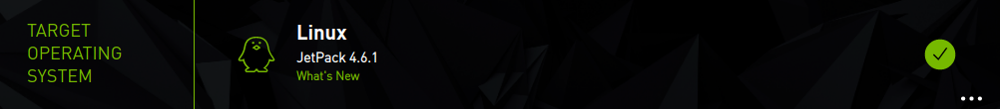

16) After the settings are finished, click "**CONTINUE TO STEP 02**".

17) "**Jetson OS**" refers to the operation system. "**Jetson SDK Components**" includes some drivers and relevant support. In this case, you need to install system on SD card so you must check "**Jetson OS**".


18) Keep the default installation path and check "**I accept terms and conditions of the license agreements**". If you need to change the installation path, you can click "**change**".


19) After settings are completed, click "**CONTINUE TO STEP 03**".

20) Enter the system account and password, then click "**OK**".


21) If the below pop-up appears, click on "**Create**".


22) Fill in the system password and click on "**OK**".


23) If the installed system is JetPack 4.6.1 or higher, the Proconfig window will occurs in the process of the installation. The development board keeps the default settings and the installation mode is set as "**Manual Setup – Jetson Nano**".


24) Select "**Pre-Config**" in the drop-down menu of the OEM Configuration and set the system account and password. Both are set as "**hiwonder**" as example. Then click "**Flash**".


>[!Note]
>
>  **if the installation option only select "Jetson OS", please jump to step 29.**

25) If the installation option "**Jetson SDK Components**" is selected, the relevant configuration window will appear.


26) The "**Connection**" option and IP keep the same settings.


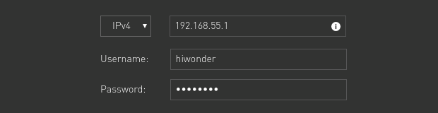

27) Enter username and password, then click "Install".


28) If the relevant detection and installation window occurs, the detection needs to take some time. After the detection is completed, click "**OK**".


29) If the below window pops up, click on "**Yes**".


30) After the system installation is finished, click on "Finish".


31) Remove the jumper cap and USB cable, and then connect screen, jumper cap, mouse and keyboard to the Jetson Nano board. Power up the Jetson Nano board and enter the system. (The jumper cap must be installed properly, otherwise, the Jetson Nano will fail to boot up.)


* **Reinstall System**

The original system must be uninstalled before reinstalling the system. Please refer to the following operation steps:

1) Please refer to the steps 1-12 in "**[1.1.11 Burn System Image -> Install SDK System and Burn JetPack](#anchor_1_1_11_4)**".

2) Click "**Repair/Uninstall**".


3) Click "**Uninstall**".


4) Enter your password. Then click "**Uninstall**" to start uninstalling the system.


5) Click "**BACK TO STEP01**".


6) Refer to the steps 13-30 in "**[1.1.11 Burn System Image -> Install SDK System and Burn JetPack](#anchor_1_1_11_4)**" to reinstall the system.

## 1.2 Jetson Nano ALT Basic Lesson

### 1.2.1 Introduction to Jetson Nano ALT

* **Jetson Nano ALT Introduction**

Jetson Nano ALT board comes with a 16GB eMMC that is a embedded Multi Media Card. User can directly write image into eMMC, no a external TF card needed as system boot driver.


Besides, without the pin switch of DC power port, Jetson Nano ALT board can prevent power is not supplied since the jumper cap is not inserted on DC port.


* **Usage Guide**

1) **Use 5V 4A DC power adapter to supply power to Jetson Nano ALT board.**


2) when supplying power, please prevent short-circuiting from contacting with screwdriver or other metal conductive objects.

3) Please handle Jetson Nano ALT with care to avoid components damage caused by hitting.

* **Hardware Structure**

The hardware structure of Jetson Nano EMMC version is as follow:


<table class="docutils-nobg" border="1">
<colgroup>
<col style="width: 35%" />
<col style="width: 64%" />
</colgroup>
<tbody>
<tr>
<td>
<p><strong>Port/PIN</strong></p>
</td>
<td>
<p><strong>Function</strong></p>
</td>
</tr>
<tr>
<td>
<p>2-channel MPI CSI interface port</p>
</td>
<td>
<p>Connect camera</p>
</td>
</tr>
<tr>
<td>
<p>Display port</p>
</td>
<td rowspan="2">
<p>Connect monitor</p>
</td>
</tr>
<tr>
<td>
<p>HDMI port</p>
</td>
</tr>
<tr>
<td>
<p>DC power interface</p>
</td>
<td>
<p>5V power input</p>
</td>
</tr>
<tr>
<td>
<p>4-channel USB 3.2 Gen1 port</p>
</td>
<td>
<p>Used to connect peripherals and the</p>
<p>maximum transmission speed is up to 5Gb ps.</p>
</td>
</tr>
<tr>
<td>
<p>Gigabit Ethernet port</p>
</td>
<td style="text-align: left;">
<p>10/100/Base-T self-adaptive. PoE power supply is supported when connecting with PoE module.</p>
<p>" 10/100/1000Base-T" means Ethernet over twisted pair carrying 10Mb/s, 100Mb/s or 1000Mb/s baseband signals.</p>
</td>
</tr>
<tr>
<td>
<p>Micro USB interface</p>
</td>
<td>
<p>5V power input or USB data transfer.</p>
</td>
</tr>
<tr>
<td>
<p>TF card slot</p>
</td>
<td>
<p>Insert TF card as capacity expansion</p>
</td>
</tr>
<tr>
<td>
<p>M.2 Key E port</p>
</td>
<td>
<p>Connect with wireless network card.</p>
</td>
</tr>
<tr>
<td>
<p>PoE pin</p>
</td>
<td>
<p>Connect with PoE module.</p>
</td>
</tr>
<tr>
<td>
<p>GPIO port</p>
</td>
<td>
<p>For extension</p>
</td>
</tr>
<tr>
<td>
<p>Fan port</p>
</td>
<td>
<p>Connect with cooling fan</p>
</td>
</tr>
</tbody>
</table>

### 1.2.2 First Start Jetson Nano ALT

When first boot up Jetson Nano board, the system needs to be configured.

* **Hardware Preparation**

1) Jetson Nano board

2) 5V 4A DC power adapter

3) monitor, mouse and keyboard

* **Power on Jetson Nano**

>[!Note]
>
>**The system image of Jetson Nano ALT has been written, you just need to boot it up according to the following operation steps.**

1) Connect monitor, mouse and keyboard to Jetson Nano ALT board. Use

HDMI cable to connect monitor to HDMI port of Jetson Nano board. Mouse and keyboard are connected to USB port, and 5V 4A power adapter to DC power port. Lastly, boot up Jetson Nano board after the network is connected.


* **System Configuration**

The system needs to be configured when first start Jetson Nano. The operation steps are as follow:

1) Accept the agreement license and click "**Continue**" .


2) Set system language and click "**Continue**" .


3) Set your location and click "**Continue**" .


4) Set user name and password, and click "**Continue**" .


5) Keep the default size setting of APP partition, and click "**Continue**" .


6) Keep the default mode setting and click "**Continue**" .


7) After system configuration is complete, Jetson Nano board will restart automatically.


8) Enter the password set in step 4, and click "**Sign In**" to enter the system desktop.


After the first use of Jetson board ALT board, it can be directly controlled via remote tool. For the remote control, please refer to the material in " **[1.2.6 Remote Desktop Configuration and Usage](#anchor_1_2_6)**".

### 1.2.3 Jetson Nano System and Desktop Introduction

* **Introduction to Jetson Nano System**

Jetson Nano is a GPU processor-based embed development board developed by NVIDIA.

The system of Jetson Nano is customized based on Ubuntu18.04, and the basic operation is the same as general Ubuntu system. Support the prevalent AI frameworks and algorithms such as TensorFlow. Caffe/Caffer, PyTorchand keras. It also includes OpenGL, OpenCV and other GPU runtime environments as well as the corresponding call interfaces.

* **Introduction to System Desktop**

The following picture shows the Jetson Nano system desktop:


**1. Task bar**

<table class="docutils-nobg" border="1">
<colgroup>
<col style="width: 14%" />
<col style="width: 28%" />
<col style="width: 57%" />
</colgroup>
<tbody>
<tr>
<td>
<p><strong>Icon</strong></p>
</td>
<td>
<p><strong>Name</strong></p>
</td>
<td>
<p><strong>Function</strong></p>
</td>
</tr>
<tr>
<td></td>
<td>
<p>Search your</p>
<p>computer</p>
</td>
<td>
<p>Search application and file in system</p>
</td>
</tr>
<tr>
<td></td>
<td>
<p>Files</p>
</td>
<td>
<p>File manger</p>
</td>
</tr>
<tr>
<td></td>
<td>
<p>LibreOffice Writer</p>
</td>
<td>
<p>Create word file</p>
</td>
</tr>
<tr>
<td></td>
<td>
<p>LibreOffice Calc</p>
</td>
<td>
<p>Create spreadsheet</p>
</td>
</tr>
<tr>
<td></td>
<td>
<p>LibreOffice</p>
<p>Impress</p>
</td>
<td>
<p>Create presentation file</p>
</td>
</tr>
<tr>
<td></td>
<td>
<p>Software</p>
</td>
<td>
<p>App store</p>
</td>
</tr>
<tr>
<td></td>
<td>
<p>System Settings</p>
</td>
<td>
<p>common system settings</p>
</td>
</tr>
<tr>
<td></td>
<td>
<p>L4T-README</p>
</td>
<td>
<p>Open the folder where the instruction file is stored</p>
</td>
</tr>
<tr>
<td></td>
<td>
<p>Trash</p>
</td>
<td>
<p>Store the deleted files.</p>
</td>
</tr>
</tbody>
</table>

**2. Menu bar**

<table class="docutils-nobg" border="1">
<colgroup>
<col style="width: 25%" />
<col style="width: 74%" />
</colgroup>
<tbody>
<tr>
<td>
<p><strong>Icon</strong></p>
</td>
<td>
<p><strong>Function</strong></p>
</td>
</tr>
<tr>
<td></td>
<td>
<p>Related device settings</p>
</td>
</tr>
<tr>
<td></td>
<td>
<p>Network settings</p>
</td>
</tr>
<tr>
<td></td>
<td>
<p>Input method</p>
</td>
</tr>
<tr>
<td></td>
<td>
<p>System notification</p>
</td>
</tr>
<tr>
<td></td>
<td>
<p>Speaker volume</p>
</td>
</tr>
<tr>
<td></td>
<td>
<p>System time</p>
</td>
</tr>
<tr>
<td></td>
<td>
<p>System control menu</p>
</td>
</tr>
</tbody>
</table>

**3. Desktop Application**

<table class="docutils-nobg" border="1">
<colgroup>
<col style="width: 14%" />
<col style="width: 28%" />
<col style="width: 57%" />
</colgroup>
<tbody>
<tr>
<td>
<p><strong>Icon</strong></p>
</td>
<td>
<p><strong>Name</strong></p>
</td>
<td>
<p><strong>Instruction</strong></p>
</td>
</tr>
<tr>
<td></td>
<td>
<p>Chromium browser</p>
</td>
<td>
<p>A browser is developed by Google</p>
</td>
</tr>
<tr>
<td></td>
<td>
<p>NVIDIA Jetson Developer Zone</p>
</td>
<td>
<p>Access NVIDA Jetson developer zone.</p>
</td>
</tr>
<tr>
<td></td>
<td>
<p>NVIDIA Jetson Support Forums</p>
</td>
<td>
<p>Access NVIDIA Jetson technical support forum.</p>
</td>
</tr>
<tr>
<td></td>
<td>
<p>NVIDIA Jetson Zoo</p>
</td>
<td>
<p>Access a web page for installation</p>
<p>instruction. This web page provides the instruction regarding how to install open source add-on packs and frameworks on Jetson Nano.</p>
</td>
</tr>
<tr>
<td></td>
<td>
<p>L4T-README</p>
</td>
<td>
<p>Access the specified folder. This folder stores instructions.</p>
</td>
</tr>
<tr>
<td></td>
<td>
<p>NVIDIA Jetson</p>
<p>Community</p>
<p>Projects</p>
</td>
<td>
<p>Access NVIDIA Jetson project forum</p>
</td>
</tr>
<tr>
<td></td>
<td>
<p>Terminal</p>
</td>
<td>
<p>Enter command in terminal to control system</p>
</td>
</tr>
</tbody>
</table>

### 1.2.4 Network Configuration (Wired and Wireless)

* **Preface**

>[!Note]
>
>**This lesson is suitable for both Jetson Nano B01 and Jetson Nano ALT. When installing wireless network card, please handle Jetson Nano with care and do not connect the port forcibly.**
>

Network is required for Jetson Nano to perform more operations. This lesson will introduce three network connection methods.

Wired network: connect Ethernet cable to RJ45 port of Jetson Nano to realize network connection.

Wireless network: install wireless network card on Jetson Nano to realize WIFI network connection.

 **1. RJ45**

RJ45 connector is a standardized telecommunication network interface with 8 -position for connecting hardware. There are two common types of RJ45

interfaces: DTE type is used for Ethernet network card, router Ethernet

interface, etc. DCE type is used for switch, etc. RJ45 interface supports 10M, 100M, and 1000M three rates, rate / duplex mode of auto-negotiation function.

**2. Wireless Network Card**

Wireless network card is a wireless terminal device, which is used to connect to the Internet through a wireless connection within the wireless coverage of a wireless local area network.

* **Wired Connection**

**1. Wiring**

>[!Note]
>
>  **It is recommend to use network cable for Jetson Nano development to ensure a stable network environment.**

1) Connect network cable to RJ45 interface, as the picture shown below:


2) If the interface flashes yellow light, as the picture shown below, which means network is connected successfully.


 **2. Detect Connection Status**

1. Start Jetson Nano and connect it with screen. 

>[!Note]
>
>For remote desktop installation and configuration, please refer to the material in " **[1.1.7 Remote Desktop Configuration and Usage](#anchor_1_1_7)**".
>

2) Double click to on system desktop to open the command line terminal.

3) Enter command "**ifconfig**" and press Enter to view the network connection status, If the IP of eth0 is 192.168.11.200 (this IP address is an example), network is connected successfully.

>[!Note]
>
>**The IP of eth0 will change with the router connected. The router needs to enable dhcp server function. Under normal circumstance, no need to manually enable dhcp service.**
>


* **Wireless Connection**

**1. Install Wireless Network Card**

>[!Note]
>
>**M2 wireless network card is applied in here. If you do not purchase Jetson Nano WIFI advanced kit, you can skip following part.**
>

1) Prepara Jetson Nano board, screwdriver, network card and antenna.

2) As the picture shown below, remove these two screws.


3) Open the two clips where the below red arrows point to.


4) Pull up the core board towards the red arrow.


5) Remove the screw for fixing network card, as the picture show below:


6) Insert network card to the position framed in following picture.


7) Tighten the screw for fixing network card, as the picture shown below:


8) There are two boxes in following picture. The red one is hole 1, and the blue one is hole 2 for connecting with antenna.


9) The antenna has two sides, as the picture shown below. The blue box shows the reverse side and the red box is the front side. You need to connect the reverse side in the corresponding position.


10) After installing antennas, the wire connected to hole 1 needs to be placed in the left side, and the wire to hole 2 needs to be placed in the right side.


11) Then insert the core board to the position shown in the picture below:


12) Tighten the screws for fixing core board.


**2. Connection**

1) Start Jetson Nano and connect with touch screen. 

2) Click on  and select "**More networks**" to select the WIFI to be connected.


3. Enter WIFI password and click "**Connect**" .


4. The following prompt will remind you WIFI is connected.


**3. Detect Connection Status**

Enter command "**ifconfig**" and press Enter to view the network connection status. If the IP of wlan0 "**192.168.11.209**" appears, network is connected successfully.

>[!Note]
>
>**The IP of wlan0 will change with the router connected. The router needs to enable dhcp server function. Under normal circumstance, no need to manually enable dhcp service.**
>


* **Connect Jetson Nano with USB Cable**

>[!Note]
>
>**If LAN is not connected to a public network, Jetson Nano will still not be able to access external resources.**
>**In addition, before connecting with USB cable, please first connect Jetson Nono to the power supply and waif for booting up.**

**1. Wiring**

Turn on Jetson Nano. Connect USB cable to the position shown in following picture and connect the other end to computer.


**2. View Device**

1) Boot up Jetson Nano board, right click on "**This computer**" to select "**Mange**" .


2) Click "**Device manger**". If you find "**Remote NDIS Compatible Device #22**", which means device is connected.


**3. View Device IP**

1) Right click network connection area and select "**Open 'Network and Internet' settings**" .


2) Click "**Change adapter**" to view adaptor.


3) The one in following red box is the required adapter.


4) Right click "**Status**".


5) Click "**Detailed Information**" .


6) If the information shown in below red box appears, it means Jetson Nano can be accessed through " **192.168.55.1**".


### 1.2.5 SSH Remote Connection

* **SSH Introduction**

SSH is a network protocol (the default port number is 22) used for encrypted login between computers and remote control via command line. Jetson Nano system has SSH service enabled by default, so you can use SSH login directly as long as the network connection is normal.

* **Preparation**

1) Refer to " **[1.2 Jetson Nano ALT Basic Lesson/ 1.2.4 Network Configuration]()**" to complete network connection.

2) **MobaXterm tool** (remote connection tool. Please find the software under the same directory with the document.)


* **Connection**

 **1. IP Search**

Reminder: if you use USB cable to connect Jetson Nano, the fixed IP is "**192.168.55.1**", you can skio this part.

1) After connecting the Jetson Nano board to the router via wireless or wired either way, the device IP can be queried through the router or MobaXterm tool.

2) If you use MobaXterm, please open tool first and follow the operation steps shown in the picture below.


3) IP address range is the possible address range of Jetson nano, generally fill in the first three input boxes with the same value as the computer IP, the last two are fixed to 1-\> 254. then click "**Start scan**" to search for all active IPs in the network.

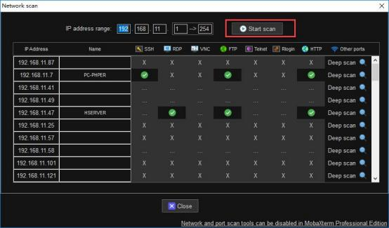

4) As shown above, at the SSH column, the devices circled in green support SSH remote connection, from which you can find out your Jetson Nano device and can choose to record the IP.


**2. Create Session and Connection**

1) In MobaXterm, click "**Session**" at the upper right corner to create a session to record the IP of Jetson Nano " **192.168.11.161**", and click "**OK**" .


>[!Note]
>
>**If you connect Jetson Nano with USB cable, you need to enter " 192.168.55.1".**


3) Enter user name and password. (The default setting is "**hiwonder**" as user name and "**hiwonder**" as password. You can modify it as needed.) Then press Enter. Please note that the password is the same as that in Linux.


>[!Note]
>
>**User name must be entered under lowercase mode when logging in, even if the set user name contains uppercase.**

5) After the password is input correctly, you will access to system successfully, as the figure shown below:


<p id="anchor_1_2_6"></p>

### 1.2.6 Remote Desktop Configuration and Usage

This lesson will explain how to remote access Jetson Nano through Nomachine.

Note: before this lesson, please refer to "[ **1.2 Jetson Nano ALT/ 1.2.4 Network Configuration**]()" to connect network.

* **Nomachine Introduction**

Nomachine allows user to remotely access Windows, Linux PC or other devices from another computer to complete differents tasks.

It is a remote desktop technology, which adopts a new remote protocol, extracts the data form desktop and transmits only some of parameters, and encrypts the data transmission through SSH, so it has a fast speed and high security performance compared to VNC or direct XDMP.

* **Install Nomachine on Computer**

1) Nomachine Tool. (remote desktop connection tool which can find under the same directory with this document.)


2) Double click "**nomachine_7.1.3_1.exe**" to open Nomachine installation package.

3) Click "**Next**" .


4) Select installation language as "**English**" . Check "**I accept the agreement**" and click "**Next**" .


5) Keep the default installation path and click "**Next**" .


6) After the following prompt appears, click "**Finish**" .


7) Click "**Yes**" to restart your computer. (**Do not skip this step!**)


* **Install Nomachine on Jetson Nano**

1) Start Jetson Nano. Open browser and open the website

"**<https://www.nomachine.com/download>**" to enter Nomachine download page. (If you use network card or network cable, you can directly enter the web page. If you use USB cable to connect Jetson Nano and computer, please refer to the following operation steps.)

2) Find "**NoMachine for ARM**" in page and click it to enter ARN version download page.


3) Then click "**NoMachine for ARM ARMv8 DEB**" to enter the download page.


4) Click "**Download**" .


5) Drag this file in download directory to "**Home**" directory.


6) Find file "**nomachine_8.1.2_1_arm64.deb**" in the same path of this document.

7) Connect Jetson Nano on MobaXterm. Drag the file "**nomachine_8.1.2_1_arm64.deb**" to the position shown in the following red box.


8) On Jetson Nano desktop, you can find "**nomachine_8.1.2_1_arm64.deb**" under Home directory.


9) In "**Home**" directory, right click a blank space and select "**Open in Terminal**" .


10) Enter command "**sudo dpkg -i nomachine_8.1.2_1_arm64.deb**" . In command, "nomachine_8.1.2_1_arm64.deb" is the default file name. If it is modified when download, the file name in command must be modified according to the actual situation.

```
sudo dpkg -i nomachine_8.1.2_1_arm64.deb
```

11) Enter the password and press Enter. Here take the default password "**hiwonder**" as example.

* **Computer Connection and Usage**

1) After installation is complete, open Nomachine and click "**Settings**" to enter the setting page.


2) Click "**Ports**" to enter the port setting page.


3) Confirm the following two options are ticked. Then complete configuration.


4) Open Nomachine on computer and enter IP address "**192.168.43.47**" in search box and click "**Connect to new host 192.168.43.47**" .


5) Enter username and password and click "**Login**" . Then you can find the Jetson Nano desktop.


* **Modify Resolution**

After entering Jetson Nano system, adjust the resolution to enable the resolution is the same as the resolution of the PC.

1) Double click  to open the command line terminal.

2) Enter command "**xrandr --fb 1920x1080**" and press Enter to modify solution. Take the resolution " **1920\*1080**" as example.

>[!Note]
>
>  **When modify the resolution, do not connect with screen. Otherwise, the display problem will occur. **

```
xrandr --fb 1920x1080
```

3) Open Nomachine again.

* **Q&A**

**1. Black Screen**

1) If Jetson Nano does not enable auto-login, black screen will occur when using Nomachine.

2) Use a monitor to connect Jetson Nano board, For auto-login setting, please refer to Step 9-13 in "**[1.2 Jetson Nano ALT-> 1.2.2 First Start Jetson Nano ALT-> System Configuration]()**" in material " **[1.2 Jetson Nano ALT/ 1.2.2 First Start Jetson Nano ALT]()**" .

**2. Blank Screen**

If there is no operation for a long time after connecting NoMachine, blank screen will occur when reopen Nomachine.

1) Close the current connection interface

2) Reconnect Jetson Nano and enter password to access desktop.


### 1.2.7 SSH File Transfer

>[!Note]
>
>**Before this lesson, please refer to the document "[1.2.5 SSH Remote Connection]()" in " [1.2 Jetson Nano ALT-> 1.2.5 SSH Remote Connection]()".**

* **Realization Goal**

Realize file transfer between computer and Jetson Nano board through SSH.

* **Tranfer File via SSH**

**1. From Computer to Jetson Nano**

1) After SSH is connected, select the files to be transferred, drag the files to MobaXterm file zone with your mouse.


2) The file will automatically be transferred to Jetson Nano system desktop.

Enter command "**ls**" to view all files.


**2. From Jetson Nano to Computer**

After SSH connection, find the file to be transferred on MobaXterm file zone, and drag file to computer desktop.


### 1.2.8 U disk Usage and Auto Mount

* **U Disk Usage Introduction**

The Jetson Nano B01 has no internal memory, while the Jetson Nano ALT has a built-in 16GB eMMC. Both can be expanded using an SD card. Besides, capacity can also be expanded by mountong the U disk in the system directory.

* **Mount U Disk**

1) Start Jetson Nano and connect to a USB port of Jetson Nano board, 

2) Double click on to open a command line terminal.

3) Enter command"**sudo mkfs.ext4 /dev/sda1**" and press Enter to format U disk.

```
sudo mkfs.ext4 /dev/sda1
```

4) If the following prompt appear, enter "y" and press Enter to confirm operation.


5) The below prompt means U disk is formatted successfully.


6) Then enter command "**sudo mount /dev/sda1 /mnt**" to mount U disk to "**/mnt**" directory which can be modify to other existed directory.

```
sudo mount /dev/sda1 /mnt
```

7) Lastly, enter command "**df -h**" to view whether the mounting is completed.

```py
df -h
```

8) If the following prompt appears, the mounting is completed successfully.


* **Auto-mount after Booting up**

After a manual mount, a system reboot will cause the mount to fail and require another mount. To avoid this, you can modify the file under the system path "**/etc/fstab**", which is used to store the static information of the file system.

When the system starts up, it will automatically read the information from this file, and will automatically mount the file system specified in this file to the specified directory, completing the function of automatic mounting on boot, as follows.

1) Start Jetson Nano board, insert U disk to one of USB ports of Jetson Nano.

2) Double click to open a command line terminal.

3) Enter command "**sudo vim /etc/fstab**" to edit fstab file.

```
sudo vim /etc/fstab
```

4) Press "**i**" key to start editing mode. In the corresponding position of the file, enter command "**/dev/sda1/mnt ntfs defaults 0 0**" which mush align with the previous line.


The input content correspond to six categories in the file. "**file system**" is the partition or storage to be mounted. "type" is the file system type of the device or partition to be mounted. "options" is the parameter to be used when mounting. "dump" is whether to back up the system file, 0 is ignored, 1 is backed up. "pass" is the retrieval sequence of file system, o for ignore, 1 for priority retrieval (usually the root directory), 2 for non-priority retrieval.

5) After confirming, press "**Esc**", enter " **:wq**" and press Enter to save and exit the file.


6) Enter command "**sudo mount -a**" to verify the editing content.

```
sudo mount -a
```

7. Lastly, enter command "**df -h**" to check whether the mounting is completed successfully.


### 1.2.9 TF Card Mounting

Jetson Nano ALT board provides TF card expansion slot which can be used to mount TF card to Jetson Nano ALT board as additional storage space. This lesson will introduce you how to mount TF card to Jetson Nano board.

* **Hardware Preparation**

1) Jetson Nano ALT board

2) 5V 4A power adapter

3) TF card (momory is 32G and above)

4) Card reader

5) Monitor, mouse, and keyboard

* **Mount TF Card to Jetson Nano Board**

The drive file"**kernel_tegra210-p3448-0002-p3449-0000-b00-user-custom.dtb**" in "**[Appendix]()**" is used in here.

1) Insert TF card to corresponding card slot of Jetson Nano ALT board, then connect monitor, mouse and keyboard.


2) Connect 5V 4A power adapter to DC power port of Jetson Nano ALT board and turn on Jetson Nano ALT board.

3) Utilize U disk to transfer the drive file to the main directory of development board.


4) Double click  or press "**Ctrl+Alt+T**" to open command line terminal.

5) Enter command "**sudo cp kernel_tegra210-p3448-0002-p3449-0000-b00-user-custom.dtb /boot/**" and press Enter to copy the drive file to the specified directory.

```
sudo cp kernel_tegra210-p3448-0002-p3449-0000-b00-user-custom.dtb /boot/
```

6) Enter command "**sudo vim /boot/extlinux/extlinux.conf**" and press Enter to open the specified file.

```
sudo vim /boot/extlinux/extlinux.conf
```

7) Enter system password, and press Enter. Here is "**hiwonder**" .


8) Press "**i**" to enter the editing mode. Find the following code.


9) Refer to the picture below to add code "**FDT /boot/kernel_tegra210-p3448-0002-p3449-0000-b00-user-custom.dtb**" .


>[!Note]
>
>**Please ensure that the input code is correct. Never modify other codes, otherwise Jetson Nano board will not start normally and you need to reinstall the eMMC system.**

10) Press "**Esc**", enter " **:wq**" and press Enter to save and exit.


11) Power up Jetson Nano board. After booting up, double click or press "**Ctrl+Alt+T**" to open command line terminal.

12) Enter command "df -h" and press Enter to check whether the device "**mmcblk1p1**" is detected by Jetson Nano board. If the device is detected, TF is mounted successfully.


### 1.2.10 Build eMMC Writing Environment

Jetson Nano ALT board comes with 16GB eMMC so the image can be written to eMMC with SDK Manager tool on virtual machine.

This lesson will teach you how to install virtual machine software and how to create virtual machine.

* **Install Virtual Machine Software**

**VMware Workstation Pro** is used in this lesson. The software installation

package is stored in " **[1. Jetson Nano Basic Lesson/ 1.2 Jetson Nano ALT/ 1.2.10 Build eMMC Writing Environment/ Virtual Machine Software]()**".

The specific installation steps are as follow:

1) Extract "**[Vmware 16.0 Pro.zip]()**" to any directory and double click "**VMware-workstation-full-16.0.0-16894299.exe**" to start installing software.

2) Click "**Next**" .


3) Accept agreement License and click "**Next**" .


4) If you want to change the installation path of software, you can click "**Change**" . After changing the installation path, click "**Next**" .


5) It is recommended to uncheck the following options. Then click "**Next**" .


6) It is recommended to keep the default setting and click "**Next**" .


7) Click "**Install**" .


8) Click "**Finish**" to activate VMware Workstation Pro.


* **Create Virtual Machine**

Ubuntu 18.04 is the system of virtual machine. The system image is stored in "[ **Appendix**]()" .

1) Double click on to open virtual machine.

2) Click "**Create a New Virtual Machine**" .


3) Keep the default setting and click "**Next**" .


4) Click "**Refer**" and select the system image file of Ubuntu 18.04, and click "**Next**" .


5) Fill in the following required information and click "Next" . (User name and password here are set as "**hiwonder**").


6) The name of virtual machine can be modified in the following first box. If want to modify the storage path, click "**Refer**". After modification, click "**Next**" .


>[!Note]
>
>**Please store virtual machine on a disk with sufficient capacity.**

7) ince the development kit image requires a certain amount of disk space, set the disk size to 100GB, and click the "**Next**".


8) Click "**Complete**".


Due to select the auto-start option, virtual machine will automatically start and proceed to install system after click "Complete" .

9) After virtual machine is installed, click the orange box on system interface.


10) Enter password and click "**Sign In**" .


### 1.2.11 Write eMMC System

* **Hardware Preparation**

1) A Jetson Nano ALT board

2) A 5V 4A power adapter

3) A jumper cap and a Dupond line

4) A USB cable (for data transmission)

5) A monitor, a mouse and a keyboard

* **Hardware Preparation**

**1. Configure Virtual Machine**

Install virtual machine software "**VMware Workstation Pro**" and create virtual machine. The specific operation steps refer to the document in " **[1. Jetson Nano basic Lesson-\> 1.2 Jetson Nano ALT -\> 1.2.10 Build eMMC Writing Environment]()**" .

**2. Sign up NVIDIA DEVELOPER Account**

Since the account of NVIDIA DEVELOPER website will be used in SDK Manager Tool, please following the steps below to sign up an account in advance.

>[!Note]
>
>**If you already have an account on NVIDIA DEVELOPER website, you can jump directly to "[1.2.11 Write eMMC System -> Install SDK Manger]()".**

1. Enter NAVID DEVELOPER website "**<https://developer.nvidia.com/>**" and click "**Join**" button on the upper right corner.


2. Enter your email that used to sign up account and click "**Next**" .


3. Fill in your account information.


4. Check "**I am Human**" to verify, and then click "**Create account**" .


5. After signing up, return to the login. Select the second option (never skip this step!).


6. After filling in the corresponding information, click "**Submit**" and check the option in following red box.


* **Install SDK Manager**

SDK Manger is stored in "**[Appendix]()**" .

>[!Note]
>
>Please install virtual machine according to "**[1.2.10 Build Writing Environment for eMMC]()**" (it is a simple installation method). If you select custom installation, "**VMware Tools**" is required to be installed.


1) Please refer to the following steps to install SDK Manager tool on virtual machine.

2) Double click on to open the virtual machine software. Click "**Power on Virtual Machine**".


3) Click the orange box, as the picture shown below.

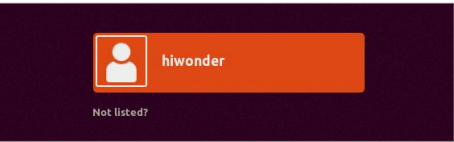

4) Enter the password of virtual machine and click "**Sign In**" to enter system desktop.


5) Drag SDK Mange installation file from your computer desktop to the system desktop of virtual machine.


6) Click on on taskbar to open file manger. Move the installation file of SDK Manager tool to home directory.


7) Click on  on taskbar. The click on  or press "**Ctrl+Alt+T**" to open command line terminal.

>[!Note]
>
>  **The entered command should be case sensitive and "Tab" key can be used to auto-complete keyword.**

8) Enter command "**sudo apt install ./sdkmanager_1.8.3-10426_amd64.deb** " and press Enter to install SDK Manager tool.

```
sudo apt install ./sdkmanager_1.8.3-10426_amd64.deb
```

9) In command, "<strong>sdkmanager_1.8.3-10426_amd64.deb</strong>" is the default name of installation file. If it is modified, the command must be synchronously modified according to the current file name.

10) Enter the password and press Enter.


>[!Note]
>
>  **The input characters are invisible in terminal.**

11) If the following prompt appears, please enter "**Y**" and press Enter.


12) After installation, click on  icon. Then you can view the icon of SDK Manger in program interface.


* **Install System on eMMC**

1) Use jumper cap or Dupond line to connect the pin "**FC REC**" and "**GND**" of Jetson Nano ALT board, which enable Jetson Nano ALT board enter Force Recovery mode. (if system is installed on Jetson Nano ALT board, only SDK is required to install, so you can skip this step.)


2) Connect 5V 4A power adapter to DC power port to boot up development board.

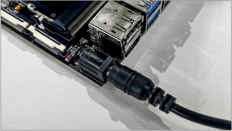

>[!Note]
>
>**The pins need to be connected first before booting up Jetson Nano ALT board.**

3) Double click to open virtual machine. Click "**Power on virtual machine**".


4) After powering on, connect Jetson Nano ALT board to you computer through USB cable.


5) If the following window appear, select "**Connect to virtual machine**" and select the virtual machine used. Then click "**OK**" to connect Jetson Nano to virtual machine.


6) If the above window does not appear, you can click "**Virtual machine/Mobile device/NVIDIA APX/Connect**" on menu bar to connect Jetson Nano to virtual machine.


7) Click on tack bar and click on  to run SDK Manager tool. If the following warning window pops up, click "**Yes**".


8) Click "**LOGIN**" .


9) Log in NVIDIA DEVELOPER website.


10) Verification is required for account login. Click the link sent by NVDIA in the email to proceed.


11) If the following window pops up, please check "**No, disable usage collection**" and click "**OK**" .


12) Select "**Jetson Nano**" and click "**OK**" .

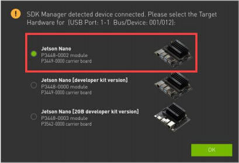

13) On "**STEP 01**" interface, uncheck "**Host Machine**" and confirm whether the selected target hardware is correct.


>[!Note]
>
>**If the development board does not be detected, please attempt to reconnect the USB cable between Jetson Nano board and computer.**

14) "**TARGET OPERATING SYSTEM**" is the system version required to be installed. Here the system is "**JetPack 4.6.2**" that can be selected as needed.


15) After setting, click "**CONTINUE TO STEP 02**".

16) "**Jetson OS**" is the operating system, and "**Jetson SDK Components**" is the partial drive and relevant support.

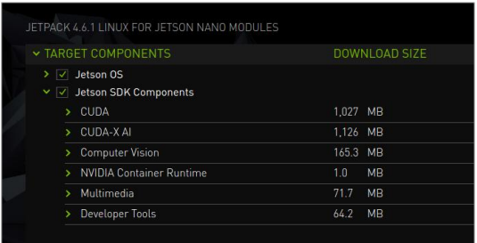

>[!Note]
>
>**When system is installed to eMMC, if only need to install drive and support, uncheck "Jetson OS" and check "Jetson SDK Components". (Please take off jumper cap and boot up)**
>

17) Keep the default installation path and accept agreement license. If want to change the installation path , click "**Change**" .


18) Click "**CONTINUE TO STEP 03**" after the setting is complete.

19) Enter the password of virtual machine and click "**OK**" .


20. If the following prompt appear, click "**Create**" to automatically create path.


21. Enter the password and click "**OK**" .


22. It the system is JetPack4.6.1 and above, Preconfig window will appear when installing. Then keep the default target hardware type and set the installation mode as "**Manual Setup -** **Jetson Nano**" .


23. In the drop-down menu of "**OEM Configuration**", select "**Pre-Config**" and set the username and password. Then click "**Flash**" .


>[!Note]
>
>**If only "Jetson OS" is checked in installation options, please jump to step 29, which will cause some functions disabled.**

24. If check "**Jetson SDK Components**" , the relevant configuration window will appear.


25. "Connection" and IP keep the default settings.


26. Enter username and password and click "**Install**" .


>[!Note]
>
>**if error is reported, please operate according to the following steps:**
>
>* **Power off Jetson Nano board and pull off the jumper cap.**
>* **Connect monitor and mouse to Jetson Nono, and then power on Jetson Nano.**
>* **Enter Jetson Nano system, and complete basic configuration according to " [1. Jetson Nano Basic Lesson/ 1.2 Jetson Nano ALT board/ 1.2.2 First Start Jetson Nano]()" . Then power off Jetson Nano, disconnect mouse and monitor.**
>* **After powering up, connect Jetson Nono to virtual machine through USB cable.**
>* **Lastly, repeat over from step 24.**

27. If the relevant window of verification appears, please wait patiently for this process to complete. Then click "**OK**" to continue installing.


28. After system is installed, click "**FINISH**" .


29. Take off jumper cap and unplug USB cable. Then connect monitor, mouse and keyboard to Jetson Nano board. Power on Jetson Nano to enter system.

>[!Note]
>
>**After "Jetson SDL Components" is stalled, if the disk space is full, please refer to "[1.2.9 TF Card Mounting]()" to learn how to improve capacity.**


* **Reinstall System**

Before reinstalling system on eMMC, you need to first uninstall original system.

1. Refer to step1-12 in "**[1.2.11 Write eMMC System -> Install System on eMMC]()**" .

2. Click "**Repair/Uninstall**" .


3. Click "**Uninstall**" .


4. Enter password and click "**Uninstall**" .


5. After uninstalling, click "**BACK TO STEP 01**" .


6. Reinstall system according to step 13-30 in "**[1.2.11 Write eMMC System ->Install System on eMMC]()**" .

### 1.2.12 Boot via TF Card

If eMMC of Jetson Nano ALT is used as system disk, the left space is not enough for installing SDK or other resources. To tackle this problem, TF card can be configured as system disk for starting Jetson Nano board.

* **Hardware Preparation**

(1) A Jetson Nano ALT board

(2) A 5V 4A power adapter

(3) A TF card

(4) A monitor, a mouse and a keyboard

>[!Note]
>
>**It is recommended to use A2/U3/V30 level TF card. The speed of TF card directly affects the device running speed. Sandisk or Samsung TF cards have been tested, which can be mounted normally and get the system boot.**

****

* **Install System to TF card**

Jetson Nano B01 board can directly start up system after inserting TF card with image while Jetson NANO ALT board needs to install systen to eMMC via TF card. TF card on Jetson Nano ALT board can only be used as the path to the root file system, but the lunch partition is till on eMMC.

Therefore, install system to eMMC first and check whether development board starts normally. Then copy eMMC system file to TF card. Lastly, modify the configuration file of Jetson Nano ALT board to enable system boot up on TF card.

For specific operation steps, please refer to "[ **1. Jetson Nano Basic Lesson/ 1.2 Jetson Nano ALT/ 1.2.11 Write eMMC System**]()" .

* **Configure TF Card as System Disk**

**1. View TF Card Device Number**

When TF card is inserted to Jetson Nano board, it is required to mounted.

Then a device number is assigned to TF card, which is similar to the disk boot on Windows. Please first view the device number of TF card on Jetson Nano ALT board.

>[!Note]
>
>**The entered command should be case sensitive and "Tab" key can be used to auto- complete keywords. For TF card mounting, please refer to " [1. Jetson Nano Basic Lesson/ 1.2 Jetson Nano ALT/ 1.2.9 TF Card Mounting]()" .**

1. Connect monitor, mouse, keyboard and TF card to Jetson Nano ALT board.

Then connect 5V 4A power adapter to DC power port of Jetson Nano board and start Jetson Nano. (for the use of remote desktop, please refer to " [**1.2.6 Remote Desktop Configuration and Usage**](#anchor_1_2_6)" .)


2) After booting up, enter password.


3) Double click on  or press "**Ctrl+Alt+T**" to open terminal.

4) Enter command "**df -h**" and press Enter to view the device number of TF card on Jetson Nano, here it is "**mmcblk1p1**" .


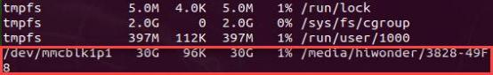

>[!Note]
>
>**Please refer to the actual query result for the device number of TF card on Jetson Nano board.**

**2. Format TF Card**

1) Double click on or press "**Ctrl+Alt+T**" to open terminal.

2. Enter command "**sudo umount /dev/mmcblk1p1**" and press Enter to unmount TF card.

```
sudo umount /dev/mmcblk1p1
```

3. Enter command "**sudo mkfs.ext4 /dev/mmcblk1p1**" and press Enter to format TF card to ext4 format.

```
sudo mkfs.ext4 /dev/mmcblk1p1
```

If the following information appear, TF card is formatted successfully.


4. After formatting, enter command "**sudo mount /dev/mmcblk1p1 /mnt**" and press Enter to mount TF card to "**/mnt**" directory.

```
sudo mount /dev/mmcblk1p1 /mnt
```

>[!Note]
>
>  If want to check whether TF card is mounted on "**/mnt**" folder, you need to enter command "**df -h**" . If "**/mnt**" folder does not appear in the last column of "**/dev/mmcblk1p1**" , TF card needs to be remounted to **/mnt** folder. Please do not skip this step, otherwise, eMMC will be filled up and unable ti boot up, then system is required to reinstall.


**3. Copy System File to TF Card**

1) Double click on or press "**Ctrl+Alt+T**" to open terminal.

2) Enter command "**sudo rsync -axHAWX --numeric-ids --info=progress2 --exclude=/proc / /mnt**" and press Enter to copy the system image into TF card.

```
sudo rsync -axHAWX --numeric-ids --info=progress2 --exclude=/proc / /mnt
```

Then enter command "**df -h**" and press Enter. The position in following two boxes are 4.9G.

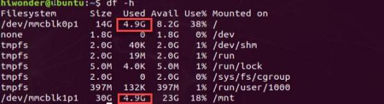

>[!Note]
>
>Please ensure the command "**--exclude=/proc / /mnt**" is entered correctly. A progress bar will be displayed in terminal after command is entered. The percentage displayed on progress bar does not present the real-time progress, so if the progress bar does not change for a long time, please be patient and wait, after the copy of the system image is finished, it will return to the mode of entering commands.
>
>You can check whether the system file is copying through entering command "**dh -f**".
>If the below prompt appear, please change other brands of TF card. (the TF used in here is sandisk 32G)
>

3) Enter command "**sudo mkdir /mnt/proc**" and press Enter to create directory.

```
sudo mkdir /mnt/proc
```

4) Enter command "**sync**" and press Enter to synchronize the data in memory buffer to TF card to avoid data loss.


**4. Modify Configuration File**

1. Double click on or press "**Ctrl+Alt+T**" to open terminal.

2. Enter command "**sudo vim /boot/extlinux/extlinux.conf**" and press Enter to open configuration file.

```
sudo vim /boot/extlinux/extlinux.conf
```

3. Find the following code:


4. Press "i" key to enter the editing mode. Change "**mmcblk0p1**" to "**mmcblk1p1**" .


>[!Note]
>
>**Please ensure the codes are entered correctly and do not modify other codes, otherwise Jetson Nano board can't boot up successfully and needs to reinstall the system of eMMC.**

5. After modification, press "**Esc**" key, enter " **:wq**" and press Enter to save and exit.


6. Enter command "**sudo reboot**" and press Enter. Then you can start Jetson Nano board from TF card.

```
sudo reboot
```

7) After restarting, double click on and press "**Ctrl+Alt+T**" to open the terminal.

8. Enter command "**df -h**" and press Enter to mount TF card (mmcb lk1p1) to root directory and mount eMMC (mmcb lk0p1) to temporary directory.


### 1.2.13 Boot via U Disk

* **Hardware Preparation**

1) A Jetson Nano ALT board

2) A 5V 4A power adapter

3) A TF card

4) A monitor, a mouse and a keyboard

* **Install System on eMMC**

Jetson series product is unable to completely dependent on U disk to boot up system. U disk can only be used as the path to the root file system, but the lunch partition is till on eMMC.

Therefore, eMMC needs to install system first before the system file is copied to U disk, and check whether Jetson Nano board is boot up successfully.

For specific operation steps, please refer to "[ **1. Jetson Nano Basic Lesson/ 1.2 Jetson Nano ALT/ 1.2.11 Write eMMC System**]()" .

* **Configure U Disk as System Disk**

 **1. View TF Card Device Number**

When U disk is inserted to Jetson Nano board, it is required to mounted, a device number is assigned to it, which is similar to the disk boot on Windows. Please first view the device number of U disk on Jetson Nano ALT board.

>[!Note]
>
>  **The entered command should be case sensitive and "Tab" key can be used to auto-complete keywords.**

1) Connect monitor, mouse, keyboard and U disk to Jetson Nano ALT board.

Then connect 5V 4A power adapter to DC power port of Jetson Nano board and start Jetson Nano.

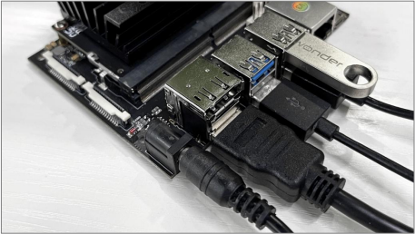

2) After booting up, enter password.


3) Double click on or press "**Ctrl+Alt+T**" to open terminal.

4) Enter command "**df -h**" and press Enter to view the device number of TF card on Jetson Nano board, here it is "**sda1**".


>[!Note]
>
>  **Please refer to the actual query result for the device number of TF card on Jetson Nano board.**

**2. Format U Disk**

1) Double click on or press "**Ctrl+Alt+T**" to open terminal.

2) Enter command "**sudo mkfs.ext4 /dev/sda1**" and press Enter to format U Disk to ext4 format.

```
sudo mkfs.ext4 /dev/sda1
```

3) When the prompt "**Proceed anyway?** " appears, please enter "**y**" and press Enter.


If the following information appear, U disk is formatted successfully.

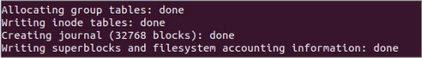

If "**/dev/ada1 is mounted**" is prompted, enter command "**sudo umount**

**/dev/sda1**" and press Enter to unmount U disk. Then repeat step 4 to format U disk.


```
sudo umount /dev/sda1
```

4) After formatting, enter command "**sudo mount /dev/sda1 /mnt**" and press Enter to mount U disk to "**/mnt**" directory.

```
sudo mount /dev/sda1 /mnt
```

**3. Copy System File to TF Card**

1) Double click on or press "**Ctrl+Alt+T**" to open terminal.

2) Enter command **"sudo rsync -axHAWX --numeric-ids --info=progress2 --exclude=/proc / /mnt**" and press Enter to copy the system image into U disk.

```
sudo rsync -axHAWX --numeric-ids --info=progress2 --exclude=/proc / /mnt
```

3) In the command, "**--exclude=/proc**" is used to specify files that do not need to be transferred.

>[!Note]
>
>  **The percentage displayed on progress bar does not present the real-time progress**

4) Enter command "**mkdir /mnt/proc**" and press Enter to create directory.

```
mkdir /mnt/proc
```

5) Enter command "**sync**" and press Enter to synchronize the data in memory buffer to U disk to avoid data loss.


**4. Modify Configuration File**

1) Double click on  or press "**Ctrl+Alt+T**" to open terminal.

2) Enter command "**sudo vim /boot/extlinux/extlinux.conf**" and press Enter to open configuration file.

```
sudo vim /boot/extlinux/extlinux.conf
```

3) Find the following code:


4) Press "i" key to enter the editing mode. Change "**mmcblk0p1**" to "**sda1**".


>[!Note]
>
>**Please ensure the codes are entered correctly and do not modify other codes, otherwise Jetson Nano board can't boot up successfully and needs to reinstall the system of eMMC.**

5) After modification, press "**Esc**" key, enter " **:wq**" and press Enter to save and exit.


6) Enter command "**sudo reboot**" and press Enter. Then you can start Jetson Nano board from U disk.

```
sudo reboot
```

7) After restarting, double click on  and press "**Ctrl+Alt+T**" to open the terminal.

8) Enter command "**df -h**" and press Enter to mount U disk (sda1) to root directory and mount eMMC (mmcb lk0p1) to temporary directory.


### 1.2.14 Restore eMMC Boot

* **Hardware Preparation**

1. Jetson Nano ALT board

2) 5V 4A power adapter

3) U disk (memory is 32G and above)

4) Monitor, mouse and keyboard

* **Configure eMMC as System Disk**

>[!Note]
>
>**The entered command should be case sensitive and "Tab" key can be used to auto-complete keywords.**

1) Connect monitor, mouse, keyboard and U disk to Jetson Nano ALT board, and connect 5V 4A power adapter to DC power port of Jetson Nano. Then turn on Jetson Nano ALT board.

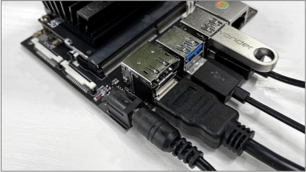

2) Enter the system password.


3) Double click on  or press "**Ctrl+Alt+T**" to open terminal.

4) Enter command "**sudo mount /dev/mmcblk0p1 /mnt**" and press Enter to mount eMMC to directory "**/mnt**" .

```
sudo mount /dev/mmcblk0p1 /mnt
```

5) Enter command "**sudo vim /mnt/boot/extlinux/extlinux.conf**" to open the configuration file.

```
sudo vim /mnt/boot/extlinux/extlinux.conf
```

Find the following code:


6) Press "**i**" key to enter the editing mode. Change "**sda1**" to "**mmcblk0p1**".


>[!Note]
>
>**Please ensure the code is entered correctly and do not modify other codes, otherwise the development board will not start normally and you need to reinstall the eMMC system.**

7) After modification ,press "**Esc**", enter " **:wq**" and press Enter to save and exit.


8) Enter command "**sudo reboot**" and press Enter to boot up Jetson Nano board.

```
sudo reboot
```

9) After booting up Jetson Nano board, click on  and press "**Ctrl+Alt+T**"to open the terminal.

10) Enter command "**df -h**" and press Enter. At this moment, eMMC

(mmcb lk0p1) is mounted on root directory while U disk (sda1) is mounted on temporary directory.


