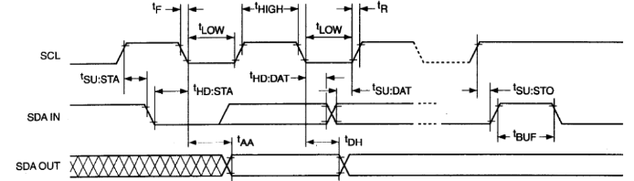

# 2. Hardware Control Lesson (Python)

## 2.1 Jetson.GPIO Library Introduction and Import

### 2.1.1 GPIO Introduction

GPIO, a general-purpose input/output, is known as I/O port. It can allocate input and output by software, and set level to read and set the status of peripheral equipment.

### 2.1.2 GPIO Library Instruction

The Jetson Nano has a 40PIN GPIO interface. GPIO voltage on the Jetson Nano is 3.3V, so no voltage levels higher than 3.3V should be connected to the Nano GPIO pins without using voltage level conversion. The GPIO interface functions as shown below.


### 2.1.3. Configure Environment and Install Library

In general, Jetson Nano system contains Jetson. GPIO library so the following steps for installation and configuration can be skipped. You can find the source code and relevant API instrcution of Jetson.GPIO library on  <https://github.com/NVIDIA/jetson-gpio>.

1) Firstly, enter the following command in sequence to install PIP tool.

```
sudo apt-get update
sudo apt-get install python-pip
sudo apt-get install python3-pip
```

2) Next, enter the following command in sequence to install Jetson.GPIO library.

```
sudo pip install Jetson.GPIO
sudo pip3 install Jetson.GPIO
```

3) Then enter below command to set user authority.

```
sudo groupadd -f -r gpio
sudo usermod -a -G gpio your_user_name
```

>[!Note]
>
>  **your_user_name** is required to be changed to your username, otherwise, library can’t be used normally.

4) Enter the following command to copy **99-gpio.rules** file to **rules.d** directory:

```
sudo cp /opt/nvidia/jetson-gpio/lib/python/Jetson/GPIO/99-gpio.rules /etc/udev/rules.d/
```

>[!Note]
>
>  **Please confirm whether the rules file in python package is stored in the path shown in above command.**

6) To put new rule into effect, run the following command to reload idev rule.

```
sudo udevadm control –reload-rules && sudo udevadm trigger
```

### 2.1.4. Use Jetson.GPIO in Python

If want to use Jetson.GPIO in Python program, it is required to add the following statement at the start of the program to import Jetson.GPIO into program.


## 2.2 GPIO Input and Read

### 2.2.1 Introduction to GPIO

GPIO, a general-purpose input/output, is a set of pins on an electronic circuit board which can be used to receive or transmit electrical signals. It’s a standard interface used to connect with external hardware device to realize external communication, external hardware control or external hardware data collection.

### 2.2.2 GPIO Input

Input is to detect the level status of each pin. "**1**" refers to high level . "**0**" refers to low level.

### 2.2.3 Introduction to Jetson Nano GPIO Pin

Jetson Nano development board has a 40 Pin interface used to connect expansion board. Calling jetson-gpio library can control GPIO port and PWM port, read, write and interrupt program.

The pins distribution is as follow:


### 2.2.4 Read Input

1) Import the program file "**GPIO_IN.py**" under the same directory with this document to home directory in controller system. For import method, please refer to "**[1. Jetson Nano Basic Lesson->1.1 Jetson Nano B01->1.1.8 SSH File Transfer](https://wiki.hiwonder.com/projects/Jetson-Nano-Development-Board/en/latest/docs/1_Jetson_Nano_Basic_Lesson.html#ssh-file-transfer)** ".


2) Double click on to open terminal. Enter command "**python3 GPIO_IN.py**" and press Enter to execute program.

```
python3 GPIO_IN.py
```

3) Then the input data of No.37 pin is printed in terminal. If there is voltage input, it will display "**1**" . If not, it will display "**0**" .


### 2.2.5 Program Analyze

**1. Import Library File**

Import GPIO library file which is preinstalled in system.

```
import Jetson.GPIO as GPIO
```

**2. Set Pin number to be read**

Set pin number. It defaults to 37 in program.

```
# Pin Definitions
input_pin = 37
```

**3. Disable Warnings Remind**

Set the warnings message by `setwarnings` function. **Flase** is to disable this function while **True** is to enable this function.

```
# Pin Setup:
GPIO.setwarnings(False)
```

**4. Set GPIO mode**

Set the coding mode of `GPIO`.

```
# Board pin-numbering scheme
GPIO.setmode(GPIO.BOARD)
```

Use `setmode` function to set the coding mode. There are four modes including BOARD, BCM, CVM and TEGRA_SOC.

**5. Initialize Pin**

Initialize pin through setup function. `input_pin` is the pin number. `GPIO.IN` is used to set pin as input mode.

```
# set pin as an input pin 
GPIO.setup(input_pin, GPIO.IN)
```

**6. Read Data**

Read the value of pin through input function. The returned value "**1**" represents high level and "**0**" represents low level.

```
value=GPIO.input(input_pin)
print(value)
```

## 2.3 GPIO Output Configuration

### 2.3.1 Introduction to GPIO

GPIO, a general-purpose input/output, is a set of pins on an electronic circuit board which can be used to receive or transmit electrical signals. It’s a standard interface used to connect with external hardware device to realize external communication, external hardware control or external hardware data collection.

### 2.3.2 GPIO Output

Output is a function required to control the pin level, and the high and low level can be presented by 1 and 0. For example, if you want to switch a LED light on, the pin connected to LED needs to be set for high level state, which will form voltage difference with another low level end to generate current to enable LED light up.

### 2.3.3 Introduction to Jetson Nano GPIO Pin

The Jetson Nano has a 40PIN GPIO interface. GPIO voltage on the Jetson Nano is 3.3V, so no voltage levels higher than 3.3V should be connected to the Nano GPIO pins without using voltage level conversion. The GPIO interface functions as shown below.


### 2.3.4 Output Setting

1) Import the program file "**GPIO_OUT.py**" under the same directory with this document to home directory in controller system.


2) Double click on to open terminal. Enter command "**python3 GPIO_OUT.py**" and press Enter to execute program.

```py
python3 GPIO_OUT.py
```

3) When the program is executed, the level of Pin 37 will keep changing between high and low levels. For example, when connect pin to 3.3V power, you can find the voltage will change between 3.3V and 0V.

### 2.3.5 Program Analysis

**1. Import Library File**

Import GPIO and time library files which is preinstalled in system.

```py
import Jetson.GPIO as GPIO
import time
```

**2. Set Pin number to be read**

Set pin number. It defaults to 37 in program.

```py
# Pin Definitions
output_pin = 37  
```

**3. Disable Warnings Remind**

Set the warnings message by `setwarnings` function. `Flase` is to disable this function while `True` is to enable this function.

```py
# Pin Setup:
GPIO.setwarnings(False)
```

**4. Set GPIO mode**

Set the coding mode of `GPIO`.

```py
# Board pin-numbering scheme
GPIO.setmode(GPIO.BOARD)
```

Use `setmode` function to set the coding mode. There are four modes including BOARD, BCM, CVM and TEGRA_SOC.

**5. Initialize Pin**

Initialize pin through setup function. `output_pin` is the pin number.

`GPIO.OUT` is used to set pin as output mode. `initial` is the initial level status.

```py
# set pin as an input pin 
GPIO.setup(output_pin, GPIO.OUT,initial=GPIO.HIGH)
```

**6. Set Output**

Set the level status through output function. `GPIO.HIGH` is high level. `GPIO.LOW` is low level.

```
while True:
            GPIO.output(output_pin, GPIO.HIGH)
            time.sleep(1)
            GPIO.output(output_pin, GPIO.LOW)
            time.sleep(1)
```

## 2.4 GPIO Pull-up and Pull-down Settings

### 2.4.1 Introduction to GPIO

GPIO, a general-purpose input/output, is a set of pins on an electronic circuit board which can be used to receive or transmit electrical signals. It’s a standard interface used to connect with external hardware device to realize external communication, external hardware control or external hardware data collection.

### 2.4.2 Pull-up and Pull-down Resistors

The pull-up resistor is to guarantee the input end without signal input to be a high level. And when the signal input is low, the level at the input should also be low.

If there is no pull-up resistor, the input end will be floating without external input and the level is unknown. The purpose of pull-up resistor is set to ensure that the input is high level when no signal inputs.

Yet, the pull-down resistor is to guarantee the input end to be high level when there is no signal inputs.

### 2.4.3 Introduction to Jetson Nano GPIO Pin

The Jetson Nano has a 40PIN GPIO interface. GPIO voltage on the Jetson Nano is 3.3V, so no voltage levels higher than 3.3V should be connected to the Nano GPIO pins without using voltage level conversion. The GPIO interface functions as shown below.


### 2.4.4 Output Setting

1. Import the program file "**PULL_UP-DOWN.py**" under the same directory with this document to home directory in controller system.


2. Double click on  to open terminal. Enter command "**sudo python3 pull_up_down.py**" and press Enter to execute program.

```
sudo python3 pull_up_down.py
```

3. When the program is executed, the level of Pin 37 will set as pull-up mode.

The pin voltage is 3.33V, i.e, high level.

### 2.4.5 Program Analysis

**1. Import Library File**

Import GPIO and time library files which is preinstalled in system.

```py
import Jetson.GPIO as GPIO
```

**2. Set Pin number to be read**

Set pin number. It defaults to 37 in program.

```py
# Pin Definitions
input_pin = 37  
```

**3. Disable Warnings Remind**

Set the warnings by `setwarnings` function. **Flase** is to disable this function while **True** is to enable this function.

```py
# Pin Setup:
GPIO.setwarnings(False)
```

**4. Set GPIO mode**

Set the coding mode of `GPIO`.

```py
# Board pin-numbering scheme
GPIO.setmode(GPIO.BOARD)
```

Use `setmode` function to set the coding mode. There are four modes including BOARD, BCM, CVM and TEGRA_SOC.

**5. Set as Pull-up Input Mode**

Initialize pin through setup function. `input_pin` is the pin number. `GPIO.IN` is the input mode. `pull_up_down` is used to set the working mode of GPIO. `GPIO.PUD_UP` is the pull-up input mode and `GPIO.DOWN` is the pull-down mode.

```py
# set pin as an input pin 
GPIO.setup(input_pin, GPIO.IN,pull_up_down=GPIO.PUD_UP)
```

**6. Read Data**

Read the pin value through input function and read turn high and low level which represented by 1 and 0.

```py
value=GPIO.input(input_pin)
print(value)
```

## 2.5 Drive Cooling Fan

When using Jetson Nano board, the core board will heat up. Therefore, cooling fan is required to dissipate heat, which keep Jetson Nona in best performance status.

1) Install cooling fan on Jetson Nano board. （ refer to the video " Install Cooling Fan"）

2) Start Jetson Nano and connect it to NoMachine.

3) Double click on  to open the command line terminal.

4) Enter command "**sudo -H pip3 install -U jetson-stats**" and press Enter to install jtop.

```
sudo -H pip3 install -U jetson-stats
```

5) Enter command "**sudo systemctl restart jetson_stats.service**" and press Enter to run **jtop** service.

```
sudo systemctl restart jetson_stats.service
```

6) Reboot system and enter command "**reboot**" and press Enter.

```
reboot
```

7) Enter command "**jtop**" and press Enter to open jtop.

```
jtop
```

8) After jtop is opened successfully, the following page will pop up. The memory of Jetson Nano hard, power and other information will present on this page.


9) According to the following format, you can witch to different interface to monitor the hardware of Jetson Nano.

| Key  | Mode and Effect                                      |
| ---- | ---------------------------------------------------- |
| 1    | Home interface. Monitor memory and power information |
| 2    | Monitor the status of GPU                            |
| 3    | Monitor the status of CPU                            |
| 4    | Monitor the status of memory                         |
| 5    | Monitor the status of fan                            |
| 6    | Monitor the installation software and its version.   |

10) After opening jtop, press key "**5**" and "**p**" to increase the rotation speed of fan, and press "**m**" or to lower the speed.

11) The cooling fan will adjust speed according to the set value.


## 2.6 UART Communication Configuration and Programming

### 2.6.1 Preparation on Your Computer

* **Install Serial Debugging Tool**

Double click "**[serial5.2.3.exe](https://drive.google.com/drive/folders/1ANfulYkT1P6qMePEVqewxti6ZH2DBN0P?usp=sharing)**" under the folder to install program. Please refer to the following steps.


* **Hardware Wiring**

The below pins of Jetson Nano will be be used:


>[!Note]
>
>  **Jetson Nano uses 5V 4A to supply power, and not need to connect to VCC.**

Use USB to TTL converter to connect Jetson Nano to PC through Female-to-female dupond line.

Wire Pin 8 (TXD) of Jetson Nano up to RXD of USB to TTL converter.

Wire Pin 10 (RXD) of Jetson Nano up to TXD of USB to TTL converter.

Wire Pin 6 (GND) of Jetson Nano up to GND of USB to TTL converter.

### 2.6.2 Preparation for Jetson Nano

* **Install Library File**

Start Jetson Nano and open command line terminal. Enter the following command to install serial function library.

```
sudo apt-get install python3-serial
```

* **Modify Serial Permission**

Set serial auto-start after Jetson Nano powers on. Enter the following command to open serial permission.

```
sudo chmod 777 /dev/ttyTHS1
```

### 2.6.3 Example Code-Send and Receive

Use serial debug tool on computer to display the received instruction character string from Jetson Nano as example.

Characters sent from PC side via the serial debug tool can also be displayed on Jetson Nano terminal.

* **Start Serial Debug Tool**

Connect USB to TTL converter to one of USB ports of your computer. Open Device Manger on computer to check of the port is detected, as the picture shown below:


If "CH340" does not appear, please check if CH340 drive is stalled on computer ( the drive can be found under the same directory with this document). If the installed drive can not be detected, please change other connection USB port.

Double click "**Serial Port Utility**".


Select the port with "CH340". Set baud rate, data bit and other attributes according to the following picture and click on .


* **Import Example Program**

1) Start Jetson Nano and connect it to Nomachine.

2) Shrink Nomachine window and drag "**UART.py**" file under this folder to Nomachine system desktop.


Enter command "**chmod a+x /home/hiwonder/Desktop/UART.py**" and press Enter to add execution permission for program.

```
chmod a+x /home/hiwonder/Desktop/UART.py
```

"**hiwonder**" here is created for this device and you can modify it in command according to the actual situation.

* **Execute Program**

1) Start Jetson Nano and connect it to Nomachine.

2) Double click on  to open command line terminal.

3) Enter command "**cd Desktop/**" to switch desktop.

```
cd Desktop/
```

4) Enter command **"python3 UART.py**" and enter command to run test code.


* **Check Outcome**

**1. Serial Debug Tool**

The message from Jetson Nano can be received and displayed on serial debug tool. The baud rate needs to be changed to "**115200**", as follow:


For example, enter "**nihao**" and click "**Send**".


**2. Jetson Nano** 

The messages from PC can be received and displayed on Jetson Nano terminal.


## 2.7 IIC Communication

### 2.7.1 Introduction to IIC Communication

IIC is also called as I2C and Inter-Integrated Circuit is short for IICBus.

It is a serial bus composed of data line SDA and clock SCL, which can send and receive data in both directions between CPU (microcontroller) and IIC module, and between IIC module and IIC module.

Features of IIC: IIC is half-duplex, not full-duplex.

IIC is a true multi-host bus, (compare SPI needs to fix the host before each communication, while IIC can change the host during the communication), if two or more hosts request the bus at the same time, the bus data can be prevented from being corrupted by conflict detection and arbitration.

The start and stop signals are sent by the host. Devices connected to the I2C bus with a hardware interface to the I2C bus can easily detect the start and stop signals.

After the start signal a 7-bit slave address + 1 direction bit must be sent, with a "0" indicating that the host sends data and a "1" indicating that the host receives data.

Whenever the host sends a byte of data to the slave, the host always needs to wait for an answer signal from the slave to confirm whether the slave has successfully received the data.

The start signal is required, the end signal and the answer signal, both can be left out.

Note: In practice, the microcontroller is usually used as the host and other devices as slaves. The microcontroller first sends a message to the device indicating that it wants to read the data, after which the transmission direction is changed and the device sends data to the microcontroller.

- **IIC physical connection**

There are many IIC devices that use IIC communication, such as gyroscope accelerometer MPU6050, EEPROM memory chip AT24C02, etc. Through the IIC bus, data can be transferred between them and the microcontroller.

There are only two IIC communication lines, the data line SDA with high and low levels transmits binary data, and the clock line SCL provides clock beats through square wave signals.

Multiple IIC devices can be connected in parallel on the IIC bus, with each device having a specific address and sharing the IIC bus on a time-sharing basis. The actual use of the IIC is of course also connected to a power supply as well as a common ground.


- **IIC time sequence**



- **Start and Stop of IIC**


- **IIC Acknowledge**


The lower waveform: the SCL is the clock pulse from master

The upper waveform: SDA, the 8-bit data output by transmitter.

The middle waveform: SDA, when the slave device pulls it low on the ninth clock signal, indicates that it has received the data sent by the master. If it is pulled high, it indicates a non-acknowledgment.

Note: the upper and the middle part refer to the same SDA wire. IIC acknowledge is a mutual relationship. When a microcontroller sends data to an IIC device, the IIC device needs to acknowledge to indicate that the data has received. Similarly, when the microcontroller receives data from an IIC device, it also needs to provide an acknowledge to the IIC device.

If there is no need to continue reading, a non-acknowledgment is sent. The recipient, thinking that the data was not received, will refrain from sending further data.

- **IIC complete transmission timing**


<p id="anchor_2_7_2"></p>

### 2.7.2 Hardware Wiring

Please refer to the below Jetson Nano pins table.


Here will take an example of acceleration sensor using IIC port. You can use this same method on other modules with IIC port. The module is connected to Jetson Nano with a female-to-female dupond wire, as shown in the below figure:

>[!Note]
>
>  **Jetson Nano uses 5V 4A to supply power, so no need to connect VCC.**

PIN3（Jetson Nano）\<--\> SDA

PIN5（Jetson Nano）\<--\> SCL

PIN6（Jetson Nano）\<--\> GND


### 2.7.3 Install IIC Library File

Power up Jetson Nano board. Open a command line terminal and enter the following command in sequence to install IIC library.

```py
sudo apt-get update
sudo apt-get install -y i2c-tools
```

Then enter a password. After the installation is installed, enter the following command to check if the installation is completed successfully.

```py
apt-cache policy i2c-tools
```


### 2.7.4 I2C-Tools Usage

* **i2cdetect**

i2cdetect is used to detect the status of I2C devices connected to system.

Enter the following command in sequence for a table of detected devices.

```py
i2cdetect -F 2
i2cdetect -l
```


Enter the below command to scan the devices mounted on the bus, such as Bus 1.

```py
i2cdetect -y -r -a 1
```

Then display the device address, such as these is a 0×68 device is connected to Bus 1. (In "**[2.7.2 Hardware Wiring](#anchor_2_7_2)**", OLED mould has connected.)


* **i2cdump**

i2cdump is used to view the data of the registers. For the used accelerometer MPU6050, its register refers to the blow table.


After entering the below command, you can view the data of all registers of device 0x68 on Bus 1.

```py
i2cdump -y 1 0x68
```


The default value "**68**" of the register is printed.

* **i2cget**

i2cget is used to view the data of an individual register. It can be used for single-byte register.

For example, enter the below command to read the value of the 0×6b register in 0×68 device.

```py
i2cget -y 1 0x68 0x6b
```


* **i2ctransfer**

i2ctransfer is used to read and write device register values and can be used for double-byte registers. For example, to read/write 16 bytes of data starting from register address 0x016b of the device with address 0x68 on Bus 1, input the following command:

```py
i2ctransfer -f -y 1 w2@0x68 0x01 0x6b r16
```

