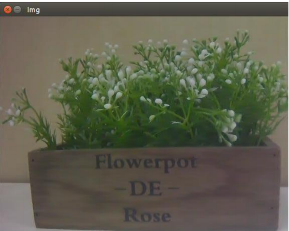
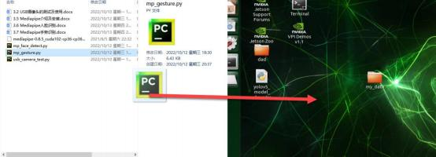

# 3. AI Entry Level Lesson

## 3.1 OpenCV Introduction

### 3.1.1 OpenCV Introduction

Open Source Computer Vision Library (OpenCV) is based on optimised C/ C++ to allow you perform image processing, computer vision and machine learning.

It was created to compute effectively and mainly focus on real-time application development. Therefore, OpenCV is widely applied in image stitching, image denoising, face recognition, posture recognition, autonomous driving and other fields.

### 3.1.2 OpenCV Features

(1) Support C, C++, Python, JAVA and MATLAB

(2) Support Linux, iOS, Android, Windows and Windows CE

(3) OpenCV is written in C++ and deeply optimized to take full advantage of multi-core processors.

### 3.1.3 OpenCV Module

Open has a modular structure and contains several shared and static libraries. Some of modules in OpenCV is introduced as follow:

| Name                                                | Instruction                                                  |
| --------------------------------------------------- | ------------------------------------------------------------ |
| Core (Core functionality)                           | Core module contains the basic structure and operation of OpenCV library |
| Imgproc (Image Processing)                          | Image processing module contains linearimage filter, geometric image conversion and color space conversion functions. |
| Highgui（High-level GUI）                           | Contain function for graphical user interface design.        |
| Video (Video Analysis)                              | Video analysis module contains motionestimation, background subtraction and target tracking algorithms. |
| Calib3d (Camera  Calibration and 3D Reconstruction) | Contain algorithm calibrating single or several monocular cameras. |
| features2d (2D Features Framework)                  | Contains algorithm for detecting, describing and matching feature. |
| Objdetect (Object Detectio)                         | Contain algorithm for detecting specific target (such as face, car) |
| ML(Machine Learning)                                | Machine learning module contains lots ofmachine learning algorithms implementation. |

## 3.2 USB Camera Test and Use

### 3.2.1 Device Connection

1) Connect USB camera to one of ports in following red box.


2) The connection effect is as follow:


### 3.2.2 Testing

1) Start Jetson Nano and connect it to Nomachine.

>[!Note]
>
>  **For Remote Desktop Installation and Configuration, please refer to** "[ **1.1.7 Remote Desktop Installation and Configuration**](https://wiki.hiwonder.com/projects/Jetson-Nano-Development-Board/en/latest/docs/1_Jetson_Nano_Basic_Lesson.html#remote-desktop-configuration-and-usage)" .

2) Double click onto open command line terminal.

3) Shrink Nomachine window and drag "**usb_camera_test.py**" file under the same directory this document to Nomchine window.


4) Right click to select "**Open Terminal**" .


5) Enter command "**cd Desktop/**" and press Enter to enter desktop.

```
cd Desktop/
```

6) Enter command "**python3 usb_camera_test.py**" and press Enter to start testing USB camera.

```
python3 usb_camera_test.py
```

7) If the following window pops up and the camera returned image appear, camera can normally be used. Press "**Esc**" to close window.


### 3.2.3 Program Analysis

Following is the test code:

```py
import cv2
if __name__ == "__main__":
    cap = cv2.VideoCapture(0)
    if cap.isOpened():
        window_handle = cv2.namedWindow("D435", cv2.WINDOW_AUTOSIZE)    
        # 逐帧显示
        while cv2.getWindowProperty("D435", 0) >= 0:
            ret_val, img = cap.read()
            cv2.imshow("D435", img)
            keyCode = cv2.waitKey(30) & 0xFF         
            if keyCode == 27:# ESC键退出
                break 
        cap.release()
        cv2.destroyAllWindows()
    else:
        print("打开摄像头失败")
```

Import opencv library:

```py
import cv2
```

Select camera. Since only a single camera is connected, the parameter is set to 0.

```py
cap = cv2.VideoCapture(0)
```

Set the window of returned image. The window name is `D435` and video size is `cv2.WINDOW_AUTOSIZE` .

```py
if cap.isOpened():
        window_handle = cv2.namedWindow("D435", cv2.WINDOW_AUTOSIZE)
```

Read and display the data of the returned image.

```py
# 逐帧显示
        while cv2.getWindowProperty("D435", 0) >= 0:
            ret_val, img = cap.read()
            cv2.imshow("D435", img)
```

Press "**Esc**" to close window.

```py
keyCode = cv2.waitKey(30) & 0xFF         
            if keyCode == 27:# ESC键退出
                break
```

If camera is not detected or other errors appear, "**Camera Open Failure**" will be printed.

```py
cap.release()
        cv2.destroyAllWindows()
    else:
        print("打开摄像头失败")
```

<p id="anchor_3_3"></p>

## 3.3 CSI Camera Introduction and Installation

### 3.3.1 CSI Camera Introduction

**The Camera Serial Interface (CSI) is** is a interface specification of the Mobile Industry Processor Interface (MIPI) Alliance with higher bandwidth and lower power consumption compared to USB cameras, and Jetson series provide a sef of Camera SubSystem to improve efficiency, making it ideal for video image input on intelligent robots.

### 3.3.2 CSI Camera Installation

* **Preparation**

1) Jetson Nano board

2) CSI Camera

3) Camera cable

* **Installation**

1) Pull up the baffle over CSI interface.


2) Insert camera cable to CSI interface. Please note that the blue side should face outward. Then press down the baffle over CSI interface.


3) Pull up the baffle of the CSI camera module.


4) Complete the wiring as follow.


## 3.4 CSI Camera Test and Use

>[!Note]
>
>  **Please complete camera assembly according to "[3.3 CSI Camera Introduction and Installation](#anchor_3_3)".**

### 3.4.1 Operation Steps

>[!Note]
>
>**The entered command should be case sensitive, and "Tab" key can be used to auto-complete key words.**

1) Start Jetson Nano and connect it to ubuntu desktop via NoMachine.

2) Import "**Camera.py**" file under the same directory with document to home directory.


3) Click on  or press "**Ctrl+Alt+T**" to open command line terminal.

4) Enter command "**python3 Camera.py**" and press Enter to start game.

```
python3 Camera.py
```

5) If want to exit this game, please press "**Ctrl+C**" in terminal. Please try multiple times for failure operation.

### 3.4.2 Outcome

After this game starts, the camera returned image will appear on screen.



### 3.4.3 Program Analysis

* **Read CSI Camera**


Posture is mainly adjusted by VideoCapture function. Take code `cv2.VideoCapture(gstreamer_pipeline(flip_method=0), cv2.CAP_GSTREAMER)` as example. The meaning of parameters is as follow:

The first parameter `gstreamer_pipeline(flip_method=0)` is the framework delivered to `gstreamer_pipeline,` which set the read property of video data.

1) The first parameter `gstreamer_pipeline(flip_method=0)` is the frame passed to `gstreamer_pipeline`, which sets the read property of the video data.

2) The second parameter `cv2.CAP_GSTREAMER` is to select Pipeline mode.

* **Read and Display Image**


First read image by calling read, then display image by calling imshow. Take code `cv2.imshow("img", frame)` as example, the meaning of parameters is as follow:

1) The first parameter `img` is the title of display window.

2) The second parameter `frame` is the camera returned image.

When press `q` to close window, release method will be called first to `release` camera, and then `destroyAllWindows` method is called to open all windows.

## 3.5 MidiaPipe Introduction and Installation

### 3.5.1 Introduction to MediaPipe

MediaPipe is an open source application framework for multi-media machine learning models. This cross-platform Framework works on mobile devices, workstations and servers, and supports mobile GPU acceleration. It also supports TensorFlow and TF Lite inference engine, any TensorFlow and TF Lite models can be used on MediaPiple. Also, on mobile and embedded

platforms, MediaPipe supports GPU acceleration on the device itself.

### 3.5.2 MediaPipe Pros and Cons

* **Advantage**

1) Support several platforms and languages, such as IOS 、Android、C++、 Python、JAVAScript 、Coral.

2) Fast speed. Model can basically run in real time.

3) High reusing rate of model and code.

* **Disadvantage**

1) For mobile, MediaPipe requires 10M or more space.

2) Deelpy dependent on TensorFlow. If want to replace it with another machine learning framework, amount of codes need to change.

3) Static images are used, which can improve efficiency but also make it difficult to detect errors.

### 3.5.3 MediaPipe Workflow

Follow is MediaPipe workflow. The process of solid line needs to write code by yourself, but no need for the process of dotted line. MediaPipe has integrated Al-related models and games. Thus, user can use MediaPipe to quickly derive the framework needed to implement a feature


### 3.5.4 Install MediaPipe

1) Start Jetson Nano and connect it to NoMachine.

2) Double click on  to open command line terminal.

3) Enter command "**sudo apt update**" to update APT download list.

```
sudo apt update
```

4) Enter command "**sudo apt install python3-pip"** and press Enter to install pip.

>[!Note]
>
>**If do not update pip, it may cause the installation to fail.**

```
sudo apt install python3-pip
```

5) Enter command "**python3 -m pip install --upgrade pip**" and press Enter to update pip.

```
python3 -m pip install --upgrade pip
```

6) Zoom in NoMachine window. Then drag

"**mediapipe-0.8.5_cuda102-cp36-cp36m-linux_aarch64.whl**" under the same directory with this document to NoMachine window.


7) Right click to select "**Open Terminal**" to open command line terminal.


8) Enter command "**pip3 install mediapipe-0.8.5_cuda102-cp36-cp36m-linux_aarch64.whl**" and press Enter to install MediaPipe. The installation needs to take some time.

```
pip3 install mediapipe-0.8.5_cuda102-cp36-cp36m-linux_aarch64.whl
```

## 3.6 MediaPipe Face Recognition

### 3.6.1 Media Face Recognition Program

1) Start Jetson Nano and connect it to NoMachine.

2) Zoom in NoMachine window and drag file "**mp_face_detect.py**" under the same directory with this document to NoMachine window.


3) Double click on  to open command line terminal.

4) Enter command "**pip3 install dataclasses**" and press Enter to install dependency package.

```
pip3 install dataclasses
```

5) Enter command "**python3 mp_face_detect.py**" and press Enter to execute program.

```
python3 mp_face_detect.py
```

6) Jetson Nano will automatically recognize and mark the face.


## 3.7 MediaPipe Gesture Recognition

### 3.7.1 Media Gesture Recognition Program

1) Start Jetson Nano and connect it to Nomachine.

2) Zoom in NoMachine window and drag the file "**mp_face_detect.py**" to NoMachine window.



3) Double click on  to open command line terminal.

4) Enter command "**pip3 install dataclasses**" and press Enter to install dependency package.

```
pip3 install dataclasses
```

5) Enter command "**python3 mp_gesture.py**" and press Enter to execute program.

```
python3 mp_gesture.py
```

Do a specific gesture within camera's field of view. When the gesture is recognized, the key points of hand are marked on returned image and the numbers of fingers is displayed on upper left corner.

