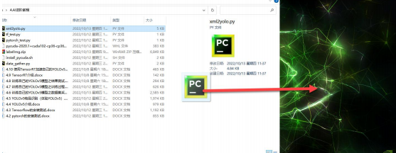

# 4. AI Advanced Lesson

## 4.1 Deep Learning Framework Introduction

### 4.1.1 Introduction to Deep Learning

Deep Learning (DL) generally refers to the classification or regression of unknown data through the training of multi-layer network structures. Essentially, it learns the inherent rules and hierarchical representations of sample data.

Deep Learning is a new research direction in the field of Machine Learning (ML), and Machine Learning is a necessary path to achieve Artificial Intelligence (AI).

The motivation behind researching Deep Learning is to establish a neural network that can imitate the human brain's mechanism to interpret data (such as images, sounds, and text), enabling machines to have analytical and learning abilities like humans.

Deep learning is mainly applied to fields including image processing, speech recognition and natural language processing.

### 4.1.2 Introduction to Deep Learning Framework

Here will introduce three commonly used deep learning framework, which are TensorFlow, PyTorch and MXNet.

* **TensorFlow**

TensorFlow is the mainstream framework in the field of current deep learning. "**Tensor**" represents N-dimensional array and "**Flow**" represents computation based on date flow diagram.

TensorFlow operates using static computational graphs, which means that the graph needs to be defined before computation. Once the constructs change, the model needs to be retrained.

TensorFlow supports various programming languages such as C++, Python, Java, JavaScript and R. TensorFlow has following advantages:

(1\) Has a powerful computing cluster.

(2\) Run models on mobile platforms such as iOS and Android.

* **PyTorch**

PyTorch is a deep learning framework based on Torch and supports C, C++ and Python.

Unlike TensorFlow, PyTorch operates with dynamic computation graphs, which can be changed in real time as needed for computation, and allows developers to create dynamic computation graphs and automatically compute gradients by accelerating the GPU to perform tensor computations.

(1\) The API design of PyTorch is simple and easy to learn.

(2\) Use dynamic computational graphs for operations, can be debugged like ordinary Python code, and error reporting instructions are easy to understand.

(3\) Provide abundant model components that enable quick implementation of ideas.

* **MXNet**

MXNet is a deep learning framework designed for high efficiency and flexibility, with a dynamic dependency scheduler at its core, capable of parallelizing the operation of symbols and commands on its own.

MXNet supports various programming languages such as C++, Python, Java, JavaScript and R. It has following advantages:

1) Support both imperative and symbolic programming models, which helps maximize efficiency.

2) Support distributed training on multi-CPU/GPU devices.

3) It uses an optimized C++ backend engine for parallel I/O and computation, achieving optimal performance regardless of the programming language used.

4) Cloud friendly and directly compatible with S3, HDFS and Azure.

## 4.2 Pytorch Installation and Test

### 4.2.1 Pytorch Installation

* **Modify Configuration File**

1) Start Jetson Nano and connect it to NoMachine.

2) Double click on  to open command line terminal.

3) Enter command "**vim .bashrc**" and press Enter to enter configuration file.

```
vim .bashrc
```

4) Jump to the end of the file and press "i" . Enter command "**export OPENBLAS_CORETYPE=ARMV8**", press "Esc", enter " :wq" and press Enter to save and exit the file.


5) Enter command "**source .bashrc**" and press Enter to update configuration.

```
source .bashrc
```

* **Install Dependency**

1. Enter command "**sudo apt-get install python3-pip libjpeg-dev libopenblas-dev libopenmpi-dev libomp-dev**" and press Enter.

```
sudo apt-get install python3-pip libjpeg-dev libopenblas-dev libopenmpi-dev libomp-dev
```

2) Enter command "**sudo -H pip3 install future**" and press Enter.

```
sudo -H pip3 install future
```

3) Enter command "**pip install numpy==1.18.4**" and press Enter.

```
pip install numpy==1.18.4
```

4) Enter command "**sudo pip3 install -U --user wheel mock pillow**" and press Enter.

```
sudo pip3 install -U --user wheel mock pillow
```

5) Enter command "**sudo -H pip3 install testresources**" and press Enter.

```
sudo -H pip3 install testresources
```

6) Enter command "**sudo -H pip3 install setuptools==58.3.0**" and press Enter.

```
sudo -H pip3 install setuptools==58.3.0
```

7) Enter command "**sudo -H pip3 install Cython**" and press Enter.

```
sudo -H pip3 install Cython
```

8) Enter command "**sudo -H pip3 install gdown**" and press Enter.

```
sudo -H pip3 install gdown
```

* **Install Pytorch**

>[!Note]
>
> **When install Pytorch, please confirm JetPake and system versions, and then select corresponding Pytorch. The provided JetPake is 4.6.2 version.**

1) Enter command "**gdown https://drive.google.com/uc?id=1TqC6_2cwqiYacjoLhLgrZoap6-sVL2sd**" and press Enter to download Pytorch installation package (can be found under the same directory).

```
gdown https://drive.google.com/uc?id=1TqC6_2cwqiYacjoLhLgrZoap6-sVL2sd
```

2) Enter command "**sudo -H pip3 install torch-1.10.0a0+git36449ea-cp36-cp36m-linux_aarch64.whl**" and press Enter to install Pytorch.

```
sudo -H pip3 install torch-1.10.0a0+git36449ea-cp36-cp36m-linux_aarch64.whl
```

* **Pytorch Installation Test**

1) Drag file "**pytorch_test.py**" under the same directory with this document to NoMachine desktop.


2) Double click onto open command line terminal.

3) Enter command "**cd Desktop/**" and press Enter to switch desktop.

```
cd Desktop/
```

4) Enter command "**python3 pytorch_test.py**" and press Enter to run text code.

```
python3 pytorch_test.py
```


## 4.3 Tesorflow Installation and Test

### 4.3.1 Introduction to Tensorflow

TensorFlow is Google's open source second-generation software library for number crunching. It is based on the data flow graph processing framework, the nodes in the graph indicates the mathematical operations, the edge indicates the data interaction between the computing nodes.TensorFlow is an open source framework for machine learning, we can use TensorFlow to quickly build neural networks, while fast training, evaluation and preservation of the network.

TensorFlow is a flexible framework. It can be operated on a single or multiple GPU and CPU of personal computer or server, or even mobile devie.

### 4.3.2 Tensorflow Installation

* **Modify Configuration File**

1) Start Jetson Nano and connect it to NoMachine.

2) Double click onto open the command line terminal.

3) Enter command "**vim .bashrc**" and press Enter to open configuration file.

```
vim .bashrc
```

4) Locate to the end of file. Press "i" and enter command "**export OPENBLAS_CORETYPE=ARMV8**" . Press "**Esc**" and enter " **:wq**" to save nd exit the file.


5) Enter command "**source .bashrc**" and press Enter to update configuration.

```
source .bashrc
```

* **Install Related Dependency**

1) Enter command "**sudo apt-get update**" and press Enter to update software source address.

```
sudo apt-get update
```

2) Enter command "**sudo apt-get install libhdf5-serial-dev hdf5-tools libhdf5-dev zlib1g-dev zip libjpeg8-dev liblapack-dev libblas-dev gfortran**" and press Enter.

```
sudo apt-get install libhdf5-serial-dev hdf5-tools libhdf5-dev zlib1g-dev zip libjpeg8-dev liblapack-dev libblas-dev gfortran
```

3) Enter command "**sudo apt-get install python3-pip**" and press Enter to update pip.

```
sudo apt-get install python3-pip
```

4) Enter command "**sudo pip3 install -U pip testresources setuptools==49.6.0**" and press Enter to update the related package

```
sudo pip3 install -U pip testresources setuptools==49.6.0
```

5) Enter command "**sudo pip3 install -U --no-deps numpy==1.19.4 future==0.18.2 mock==3.0.5 keras_preprocessing==1.1.2 keras_applications==1.0.8 gast==0.4.0 protobuf pybind11 cython pkgconfig packaging**" and press Enter to install corresponding dependency.

```
sudo pip3 install -U --no-deps numpy==1.19.4 future==0.18.2 mock==3.0.5 keras_preprocessing==1.1.2 keras_applications==1.0.8 gast==0.4.0 protobuf pybind11 cython pkgconfig packaging
```

6) Enter command "**sudo env H5PY_SETUP_REQUIRES=0 pip3 install -U h5py==3.1.0**" and press Enter to install python dependency package.

```
sudo env H5PY_SETUP_REQUIRES=0 pip3 install -U h5py==3.1.0
```

* **Install Tensorflow**

>[!Note]
>
>**It has to take some time to installing Tensor. Try few more times for failure installation.**

Enter command "**sudo pip3 install --pre --extra-index-url https://developer.download.nvidia.com/compute/redist/jp/v461tensorflow-gpu**" and press Enter to install Tensorflow.

```
sudo pip3 install --pre --extra-index-url https://developer.download.nvidia.com/compute/redist/jp/v461tensorflow-gpu
```


* **Pytorch Installation**

1) Drag "**tf_test.py**" under the same directory with this document to NoMachine desktop.


2) Double click onto open command line terminal.

3) Enter command "**cd Desktop/**" and press Enter to swap desktop.

```
cd Desktop/
```

4) Enter command "**python3 tf_test.py**" and press Enter to run the test code.

```
python3 tf_test.py
```


## 4.4 Yolov5 Model Training

### 4.4.1 Yolo Model Series Introduction

* **Yolo**

YOLO (You Only Look Once) is an one-stage regression algorithm based on deep learning.

R-CNN series algorithm dominates target detection domain before YOLOv1 is released. It has higher detection accuracy, but cannot achieve real-time detection due to its limited detection speed engendered by its two-stage network structure.

To tackle this problem, YOLO is released. Its core idea is to redefine target detection as a regression problem, use the entire image as network input, and directly return position and category of Bounding Box at output layer.

Compared with traditional methods for target detection, it distinguishes itself in high detection speed and high average accuracy.

* **Yolov5**

YOLOv5 is an optimized version based on previous YOLO models, whose detection speed and accuracy is greatly improved.

In general, a target detection algorithm is divided into 4 modules, namely input end, reference network, Neck network and Head output end. The following analysis of improvements in YOLOv5 rests on these four modules.

1) Input end: YOLOv5 employs Mosaic data enhancement method to increase model training speed and network accuracy at the stage of model training. Meanwhile, adaptive anchor box calculation and adaptive image scaling methods are proposed.
2) Reference network: Focus structure and CPS structure are introduced in YOLOv5.

3) Neck network: same as YOLOv4, Neck network of YOLOv5 adopts FPN+PAN structure, but they differ in implementation details.

4) Head output layer: YOLOv5 inherits anchor box mechanism of output layer from YOLOv4. The main improvement is that loss function GIOU_Loss, and DIOU_nms for prediction box screening are adopted.

### 4.4.2 Yolov5 Model Structure

* **Component**

**1. Convolution layer: extract features of the image**

Convolution refers to the effect of a phenomenon, action or process that occurs repeatedly over time, impacting the current state of things. Convolution can be divided into two components: "**volume**" and "**accumulation**". "**Volume**" involves data flipping, while "**accumulation**" refers to the accumulation of the influence of past data on current data. Flipping the data helps to establish the relationships between data points, providing a reference for calculating the influence of past data on the current data.

In YOLOv5, the data being processed is typically an image, which is two-dimensional in computer vision. Therefore, the convolution applied is also a two-dimensional convolution, with the aim of extracting features from the image. The convolution kernel is an unit area used for each calculation, typically in pixels. The kernel slides over the image, with the size of the kernel being manually set.

During convolution, the periphery of the image may remain unchanged or be expanded as needed, and the convolution result is then placed back into the corresponding position in the image. For instance, if an image has a resolution of 6 ×6, it may be first expanded to a 7 ×7 image, and then substituted into the convolution kernel for calculation. The resulting data is then refilled into a blank image with a resolution of 6 ×6.


**2. Pooling layer: enlarge the features of image**

The pooling layer is an essential part of a convolutional neural network and is commonly used for downsampling image features. It is typically used in combination with the convolutional layer. The purpose of the pooling layer is to reduce the spatial dimension of the feature map and extract the most important features.

There are different types of pooling techniques available, including global pooling, average pooling, maximum pooling, and more. Each technique has its unique effect on the features extracted from the image.

Let's take maximum pooling as an example to explain how it works. Before understanding the maximum pooling, we need to understand the filter. Similar to the convolution kernel, the filter requires us to manually set the area. During the calculation, the filter is slid across the image, and the pixels in the area are compared. The maximum value of the pixels in the area is selected and becomes the output for that region. This process results in a reduced feature map size, which helps in reducing computational complexity and prevents overfitting.

In summary, the pooling layer plays a crucial role in feature extraction and downsampling. It helps to extract the most important features from an image and reduce the computational complexity of the neural network. Different types of pooling techniques can be used depending on the application requirements.


Maximum pooling can extract the most distinctive features from an image, while discarding the remaining ones. For example, if we take an image with a resolution of 6×6 pixels, we can use a 2×2 filter to downsample the image and obtain a new image with reduced dimensions.


**3. Upsampling layer: restore the size of an image**

This process is sometimes referred to as "anti-pooling". While upsampling restores the size of the image, it does not fully recover the features that were lost during pooling. Instead, it tries to interpolate the missing information based on the available information.

For example, let's consider an image with a resolution of 6 ×6 pixels. Before upsampling, use 3X3 filter to calculate the original image so as to get the new image.


**4. Batch normalization layer: organize data**

It aims to reduce the computational complexity of the model and to ensure that the data is better mapped to the activation function.

Batch normalization works by standardizing the data within each mini-batch, which reduces the loss of information during the calculation process. By retaining more features in each calculation, batch normalization can improve the sensitivity of the model to the data.


**5. RELU layer: activate function**

The activation function is a crucial component in the process of building a neural network, as it helps to increase the nonlinearity of the model. Without an activation function, each layer of the network would be equivalent to a matrix multiplication, and the output of each layer would be a linear function of the input from the layer above. This would result in a neural network that is unable to learn complex relationships between the input and output.

There are many different types of activation functions. Some of the most common activation functions include the ReLU, Tanh, and Sigmoid. For example, ReLU is a piecewise function that replaces all values less than zero with zero, while leaving positive values unchanged.


**6. ADD layer: add tensor**

In a typical neural network, the features can be divided into two categories: salient features and inconspicuous features.

The ADD layer works by adding the tensors of salient features, which can help to amplify their importance and improve the overall performance of the model.


**7. Concat layer: splice tensor**

It is used to splice together tensors of features, allowing for the combination of features that have been extracted in different ways. This can help to increase the richness and complexity of the feature set.


* **Compound Element**

When building a model, using only the layers mentioned above to construct functions can lead to lengthy, disorganized, and poorly structured code. By assembling basic elements into various units and calling them accordingly, the efficiency of writing the model can be effectively improved.

**1. Convolutional unit**:

A convolutional unit consists of a convolutional layer, a batch normalization layer, and an activation function. The convolution is performed first, followed by batch normalization, and finally activated using an activation function.


**2. Focus module**

The Focus module for interleaved sampling and concatenation first divides the input image into multiple large regions and then concatenates the small images at the same position within each region to break down the input image into several smaller images. Finally, the images are preliminarily sampled using convolutional units.

As shown in the figure below, taking an image with a resolution of 6 ×6 as an example, if we set a large region as 2 ×2, then the image can be divided into 9 large regions, each containing 4 small images.

By concatenating the small images at position 1 in each large region, a 3 ×3 image can be obtained. The small images at other positions are similarly concatenated, and the original 6 ×6 image will be broken down into four 3 ×3 images.


**3. Residual unit**

The function of the residual unit is to enable the model to learn small changes in the image. Its structure is relatively simple and is achieved by combining data from two paths.

The first path uses two convolutional units to sample the image, while the second path does not use convolutional units for sampling but directly uses the original image. Finally, the data from the first path is added to the second path.


**4. Composite Convolution Unit**

In YOLOv5, the composite convolution unit is characterized by the ability to customize the convolution unit according to requirements. The composite convolution unit is also realized by superimposing data obtained from two paths.

The first path only has one convolutional layer for sampling, while the second path has 2x+1 convolutional units and one convolutional layer for sampling. After sampling and splicing, the data is organized through batch normalization and then activated by an activation function. Finally, a convolutional layer is used for sampling.'


**5. Compound Residual Convolutional Unit**

The compound residual convolutional unit replaces the 2x convolutional layers in the compound convolutional unit with x residual units. In YOLOv5, the feature of the compound residual unit is mainly that the residual units can be customized according to the needs.


**6. Composite Pooling Unit**

The output data of the convolutional unit is fed into three max pooling layers and an additional copy is kept without processing. Then, the data from the four paths are concatenated and input into a convolutional unit. Using the composite pooling unit to process the data can significantly enhance the features of the original data.'


* **Structure**

Composed of three parts, YOLOv5 can output three sizes of data. Data of each size is processed in different way. The below picture is the output structure of YOLOv5.


Below is the output structures of data of three sizes.


## 4.5 YOLOv5 Object Recognition

### 4.5.1 Prior Bounding Box

When an image is input into model, object detection area requires us to offer, while prior bounding box is that box used to mark the object detection area on image before detection.


### 4.5.2 Prediction Box

The prediction box is not required to set manually, which is the output result of the model. When the first batch of training data is input into model, the prediction box will be automatically generated with it. The position in which the object of same type appear more frequently are set as the center of the prediction box.


### 4.5.3 Anchor Box

After the prediction box is generated, deviation may occur in its size and position. At this time, the anchor box serves to calibrate the size and position of the prediction box.

The generation position of anchor box is determined by prediction box. In order to influence the position of the next generation of the prediction box, the anchor box is generated at the relative center of the


### 4.5.4 Realization Process

After the data is calibrated, a prior bounding box appears on image. Then, the image data is input to the model, the model generates a prediction box based on the position of the prior bounding box. Having generated the prediction box, an anchor box will appear automatically. Lastly, the weights from this training are updated into model.

Each newly generated prediction will be influenced by the last generated anchor box. Repeating the operations above continuously, the deviation of the size and position of the prediction box will be gradually erased until it coincides with the priori box.


### 4.5.5 Start YOLOv5

* **Install Dependency**

1) Start Jetson and connect it to NoMachine.

>[!Note]
>
>**For remote desktop installation and configuration, please refer to the document in "[1.1.7 Remote Desktop Configuration and Use](https://wiki.hiwonder.com/projects/Jetson-Nano-Development-Board/en/latest/docs/1_Jetson_Nano_Basic_Lesson.html#remote-desktop-configuration-and-usage)".**

2) Double click on  to open the command line terminal.

3) Enter command **git clone https://github.com/ultralytics/yolov5.git** and press Enter to enter Yolo5-related file.

```
git clone https://github.com/ultralytics/yolov5.git
```

4) Enter command "**cd yolov5**" and press Enter.

```
cd yolov5
```

5) Enter command "**vi requirements.txt**" and press Enter to open Yolo5 folder.

```
vi requirements.txt
```

Modify the file according to the following image.


6) Enter command "**sudo apt install -y libfreetype6-dev**" and press Enter to install dependency package.

```
sudo apt install -y libfreetype6-dev
```

7) Enter command "**pip3 install -r requirements.txt**" and press Enter to install the package inside "**requirements.txt**" file.

```
pip3 install -r requirements.txt
```

8) Enter command "**sudo apt-get install -y libopenblas-base libopenmpi-dev**" and press Enter.

```
sudo apt-get install -y libopenblas-base libopenmpi-dev
```

9) Enter command "**sudo apt install -y libjpeg-dev zlib1g-dev**" and press Enter to install the required package.

```
sudo apt install -y libjpeg-dev zlib1g-dev
```

10) Drag "**torchvision-0.11.0a0+fa347eb-cp36-cp36m-linux_aarch64**" under the same directory with this document to NoMachine desktop.


11. Enter command "**cd Desktop/**" to switch desktop.

```
cd Desktop/
```

12) Enter command "**pip install torchvision-0.11.0a0+fa347eb-cp36-cp36m-linux_aarch64.whl**" and press Enter to install torchvision.

```
pip install torchvision-0.11.0a0+fa347eb-cp36-cp36m-linux_aarch64.whl
```

* **Start**

1) Drag "**yolov5n.pt**" under the same directory with this document to NoMachine desktop.


2) Double click on  to open the command line terminal.

3) Enter command "**cd Desktop/**" and press Enter to swap desktop.

```
cd Desktop/
```

4) Enter command "**cp /home/hiwonder/Desktop/yolov5n.pt /home/hiwonder/yolov5/**" and press Enter to copy model file to yolov5 folder.

```
cp /home/hiwonder/Desktop/yolov5n.pt /home/hiwonder/yolov5/
```

5) Enter command "**cd yolov5/**" and press Enter to enter yolov5 folder.

```
cd yolov5/
```

6) Enter command "**python3 detect.py --weights yolov5n.pt --source 0**" and press Enter to start target detection.

```
python3 detect.py --weights yolov5n.pt --source 0
```

>[!Note]
>
>**This step is for USB camera. If you don't have it, please directly move to next step. After finishing this step and displaying image from camera, it means the model has been enabled, no need to proceed to following steps.**

Waiting for a period of time. The camera returned image will display. Finally, select command line terminal and press "**Ctrl+C**" to close the display.


7) Enter command "**vim test.py**" and press Enter to edit test.py folder.

```
vim test.py
```

8) Modify `yolov5s` in following red box as `yolov5n` . Then press "Esc", enter " :wq" and press Enter to save and exit.


9) Enter command "**python3 test.py**" and press Enter to start object detection.

```
python3 test.py
```


<p id="anchor_4_6"></p>

## 4.6 Data Set Acquisition

### 4.6.1 Image Acquisition

1) Start Jetson Nano and connect it to NoMachine.

2) Connect USB camera to Jetson Nano.

3) Zoom in NoMachine desktop. Drag "**data_gather.py**" under the same directory with this document to NoMachine desktop.


4) Double click on and press Enter to open the command line terminal.

5) Enter command "**cd Desktop/**" and press Enter to swap desktop.

```
cd Desktop/
```

6) Enter command "**python3 data_gather.py**" and press Enter to start collect data.

```
python3 data_gather.py
```

The returned camera image appears, as the figure shown blow.


>[!Note]
>
>* **Press "S" to save the returned camera image. Long press "S" for continuous save.**
>* **Press "Q" to exit program.**
>* **To improve the model reliability, please shot object to be recognized from different distances, rotation angles and tilt angles.**
>


After starting data collection, "**My_data**" folder is created on the desktop, which contains three folders: Annotations, imageSets, and JPEGImages, where JPEGImages is used to store images, Annotations is used to store annotations, and imageSets is used to store paths to images.

### 4.6.2 Image Annotation

>[!Note]
>
>**The entered command should be case sensitive and "Tab" key can be used to auto-complete keywords.**

1) Zoom in NoMachine desktop, and drag "**labelImg.zip**" under the same directory with this document to NoMachine desktop.


2) Double click on  to open the command line terminal.

3) Enter command "**cd Desktop/**" and press Enter to exit desktop.

```
cd Desktop/
```

4) Enter command "**unzip labelImg.zip -d ./**" and press Enter to extract the file.

```
unzip labelImg.zip -d ./
```

5) Enter command "**cd labelImg/**" and press Enter to enter labelImg folder.

```
cd labelImg/
```

6) Enter command "**python3 labelImg.py**" and press Enter to open annotation software.

```
python3 labelImg.py
```


|                            Button                            | Shortcut Key |                         Function                         |
| :----------------------------------------------------------: | :----------: | :------------------------------------------------------: |
|  |    Ctrl+U    |     Select the directory where the picture is saved      |
|  |    Ctrl+R    | Select the directory where the calibration data is saved |
|  |      W       |                  Create annotation box                   |
|  |    Ctrl+S    |                     Save annotation                      |
|  |      A       |                Swap to the previous image                |
|  |      D       |                  Swap to the next image                  |

7) Press "**Ctrl+U**" and select the directory

"**/home/hiwonder/Desktop/my_data/JPEGImages/**" where the image is saved. Then click "**Open**" .


8) Press "**Ctrl+R**" and select directory "**/home/hiwonder/my_data/Annotations/**" where calibration data is saved . Then click "**Open**".


9) Press "**W**" key on keyboard to create annotation box.

Move your mouse cursor to the appropriate position. Long press the left mouse to drag the marker box to completely cover the recognition object. Then release mouse button to complete the selection of the recognition object.


10) Name the category of the recognition objects in the pop-up window. Here it is "**right**" . Then click on "**OK**" or press "**Enter**" to save this category.

>[!Note]
>
>**label name can be modified by yourself.**


11) Use "**Ctrl+S**" to save the annotation data of the current image.

12) Complete the annotation operations to other images according to steps 4-6.

13) Click  on system status bar and open file manager to enter directory"**~/Desktop/my_data/Annotations**" to view the annotation file of the images.


### 4.6.3 Format Conversion

>[!Note]
>
>**The entered command should be case sensitive, and "Tab" key can be used to auto-complete keywords.**

1) Start Jetson Nano and connect it to NoMachine.

2) Zoom in NoMachine window and drag "**xml2yolo.py**" under the same directory with this document to NoMachine desktop.




3) Double click on to open the command line terminal.

4) Enter command "**cp ./Desktop/xml2yolo.py ./Desktop/my_data/**" and press Enter.

```
cp ./Desktop/xml2yolo.py ./Desktop/my_data/
```

5) Enter command "**cd Desktop/my_data/**" and press Enter.

```
cd Desktop/my_data/
```

6) Enter command "**sudo vim /classes.names**" and press Enter.

```
sudo vim /classes.names
```

7) Click the "**i**" key to enter ed it mode and add the class name of the target recognition object. When you need to add more than one class name, one class name is one line.


>[!Note]
>
>**The name of class added in here must be in accordance with the name in "labelImg" image annotation tool.**

8) After entering, press "**Esc**" and enter " **:wq**" to save and exit file.

```
:wq
```

9) Enter command "**python3 /home/hiwonder/Desktop/my_data/xml2yolo.py --data /home/hiwonder/Desktop/my_data --yaml /home/hiwonder/Desktop/my_data/data.yaml**" to convert the data format and press "**Enter**".

```
python3 /home/hiwonder/Desktop/my_data/xml2yolo.py --data /home/hiwonder/Desktop/my_data --yaml /home/hiwonder/Desktop/my_data/data.yaml
```

The following prompt will occur if format is formatted successfully.

>[!Note]
>
>**The content in the box below is for reference only. It will be changed due to the different number and name of tag settings, and the change will be based on the number and name of tag settings.**


## 4.7 Training Process

>[!Note]
>
>**The entered command should be case sensitive, and "Tab" key can be used to auto-complete keywords.**

1) Start Jetson Nano and connect it to NoMachine.

2) Double click on to open the command line terminal.

3) Enter command "**cd yolov5/**" and press Enter to enter the specific directory.

```
cd yolov5/
```

4) Enter command "**python3 train.py --img 640 --batch 8 --epochs 5 --data /home/hiwonder/Desktop/my_data/data.yaml --weights ./my_yolov5.pt**" and press Enter to train model.

```
python3 train.py --img 640 --batch 8 --epochs 5 --data /home/hiwonder/Desktop/my_data/data.yaml --weights ./my_yolov5.pt
```

In command, `--img` is the image size. `--batch` is the number of single inputs for image. `--epochs` is the numbers of training. `--data`is the path to data set. `--weights` is the name and path of weights. The model will finally be stored in yolov5 folder named `my_yolov5.pt`.
The above parameters can be modified. If want to increase the model reliability, you can increase the training times but it needs to take longer time.

>[!Note]
>
>**The used data require to be collected from "[4.6 Data Set Acquisition](#anchor_4_6)".**

5) When the following option appears, enter "**3**" and press Enter.


If the following content appear, it is training.


## 4.8 Model Testing

### 4.8.1 Target Detection through USB Camera

1) Start Jetson Nano and connect it to NoMachine.

2) Double click on  to open the command line terminal.

3) Enter command "**cd yolov5/**" and press Enter to enter the specific directory

```
cd yolov5/
```

4) Enter command "**python3 detect.py --weights my_yolov5n.pt --source 0**" to start target detection.

>[!Note]
>
>  **Without camera, you can directly skip this step. After complete this step and see the live camera feed, it means the model is enabled.**

```
python3 detect.py --weights my_yolov5n.pt --source 0
```

5) Wait for a while, the boxes on live camera feed occur, which means model has been enabled.

`class_name` is the category name of target recognition content. `box` is the start coordinate (upper left corner) and end coordinate (lower right corner) of the identification box. `score` is the confidence of detection and recognition.

Finally, select the command bar and press "Ctrl+C" to close it.


### 4.8.2 Start Target Detection

1) Drag the picture for target detection to the desktop of NoMachine. Take the picture "**test.png**" as example.


2) Double click to open command line terminal.

3) Enter command "**cd Desktop/**" to enter system desktop.

```
cd Desktop/
```

4) Enter command "**cp /home/hiwonder/Desktop/test.png /home/hiwonder/yolov5**" and press "**Enter**" to copy the picture to be detected to yolov5 folder.

```
cp /home/hiwonder/Desktop/test.png /home/hiwonder/yolov5
```

5) Enter command "**cd ~/yolov5/**" to enter yolov5 folder.

```
cd ~/yolov5/
```

6) Enter command "**vim test.py**" and press Enter to edit **test.py** folder.

```
vim test.py
```

7) Modify `yolov5sn` shown in the following red box to `my_yolov5` .

Then press "**Esc**" and enter " **:wq**" to save and exit.


Modify "**https://ultralytics.com/images/zidane.jpg**" shown in the following red box to the picture to be detected. Press "**Esc**" and enter " **:wq**" to save and exit.

>[!Note]
>
>**The file "text. png" in following picture is only for reference. The real file name of the picture to be detected is required to be filled in.**


8) Enter command "**python3 test.py**" and press Enter to start target detection.

```
python3 test.py
```


## 4.9 TensorRT Acceleration

### 4.9.1 TensorRT Acceleration Description

TensorRT is a high-performance deep learning inference, includes a deep learning inference optimizer and runtime that delivers low latency and high throughput for inference applications. It is deployed to hyperscale data centers, embedded platforms, or automotive product platforms to accelerate the inference.

TensoRT supports almost all deep learning frameworks, such as TensorFlow, Caffe, Mxnet and Pytorch. Combing with new NVIDIA GPU, TensorRT can realize swift and effective deployment and inference on almost all frameworks.

To accelerate deployment inference, multiple methods to optimize the models are proposed, such as model compression, pruning, quantization and knowledge distillation. And we can use the above methods to optimize the models during training, however TensorRT optimize the trained models. It improves the model efficiency through optimizing the network computation graph.

After the network is trained, you can directly put the model training file into tensorRT without relying on deep learning framework.

### 4.9.2 Optimization Methods


1) Adopting horizontal or vertical layer fusion, TensorRT greatly decrease the amount of layers so as to reduce kernel launches and memory reading.

In horizontal layer fusion, convolution, bias, and ReLU layers are fused to form a single layer which is called CBR structure. After fusion, this layer only occupies one CUDA core. Vertical layer fusion is to combine layers in the same structure but with different weights into a wider layer which also use one CUDA core.

In addition, although multiple branches are fused, TensorRT can directly connect to the required place without special concat operation, so this layer can also be canceled. After layer fusion, the computation graph has less layers and occupies less CUDA cores resulting in smaller, faster, and more effective model structure.

2) The Tensor in the network of most deep learning frameworks when training the neural network is 32-bit floating-point precision (FP32). Once the network is trained, backpropagation is no longer required in deployment inference, so the data precision can be reduced. Lower data precision will minimize the storage occupation and latency, and make the model size smaller.

The dynamic ranges of different precision are listed below.

| Precision | Dynamic Range                                  |
| --------- | ---------------------------------------------- |
| FP32      | −3.4 × 1038 +3.4 × 1038−3.4 × 1038 +3.4 × 1038 |
| FP16      | −65504 +65504−65504 +65504                     |
| INT8      | −128 +127−128 +127                             |


INT8 has only 256 different values. Using INT8 to represent values with FP32 precision will definitely omit information and engender performance degradation. However, TensorRT can provide a fully automated calibration that can reduce FP32 precision to INT8 precision with the best matching performance to minimize performance loss.

**Kernel Auto-Tuning**: Network model recalls CUDA core of GPU to infer and compute. According to different algorithms, network models and GPU platform, TensorRT can implement kernel-level optimization to enable the model to compute on the specific platform with best performance.

**Dynamic Tensor Memory**: When using the tensor, TensorRT will designate its memory to avoid repetitive application, reduce storage occupation and improve the reuse efficiency.

**Multi-Stream Execution**: TensorRT employs stream technology of CUDA to perform parallel operation on multiple branches with the same input, and can optimize based on different batchsize.

## 4.10 Accelerate Custom YOLOv Model with TensorRT

### 4.10.1 Convert Format

>[!Note]
>
>**The entered command should be case sensitive and "Tab" key can to used to auto-complete keywords.**

1) Start Jetson Nano and connect it to NoMachine.

2) Double click on to open the command line terminal.

3) Enter command "`git clone https://github.com/wang-xinyu/tensorrtx.git`" and press "**Enter**" to download TensorRT-related file.

```
git clone https://github.com/wang-xinyu/tensorrtx.git
```

4) Enter command "`cp ./tensorrtx/yolov5/gen_wts.py ./yolov5`" and press "**Enter**" to copy "**gen_wts.py**" that converts .pt file to .wst file. to yolov5 folder.

```
cp ./tensorrtx/yolov5/gen_wts.py ./yolov5
```

5) Enter command "**cd yolov5/**" and press Enter to enter yolov5 folder.

```
cd yolov5/
```

6) Enter command "**python3 gen_wts.py -w yolov5n.pt -o yolov5n.wts**" and press Enter to convert the file from .pt to .wts.

```
python3 gen_wts.py -w yolov5n.pt -o yolov5n.wts
```

>[!Note]
>
>**The official yplpv5n model is used in here. For other models, you need to change "yolov5n.pt" in command to the name of model used.**

7) Open a new command line. Enter command "**cd tensorrtx/yolov5**"and press Enter to enter tensorrtx/yolov5 folder.

```
cd tensorrtx/yolov5
```

8) Enter command "**vim yololayer.h**" and press Enter to open yololayer.h file.

```
vim yololayer.h
```

9) Find the code in red box below. The parameter is the number of classes of target recognition content and needs to be modified according to the actual situation.


10) After modification, press "**Esc**", enter " :**wq**" and press Enter to save and exit.

```
:wq
```

11) Enter command "**mkdir build**" and press **Enter** to create **build** folder .

```
mkdir build
```

12) Enter command "**cd build/**" and press **Enter** to enter folder.

```
cd build/
```

13) Enter command "**cmake ..**" and press **Enter** to compile folder.

```
cmake ..
```

14) Enter command "**make**" and press **Enter** to compile the content in build folder.

```
make
```

15) Enter command "**sudo ./yolov5 -s yolov5n.wts yolov5n.engine n**" and press Enter to generate TensorRT model file "**yolov5n.engine**"

```
sudo ./yolov5 -s yolov5n.wts yolov5n.engine n
```

`yolov5n.wts` in command refers to the path where yolov5n.wts file is located. Since it has stored in the category where .wts file should be stored, so here just need to enter the name of .wts file. `yolov5n.wts` is the file name of TensorRT model.

If the prompt "**Build engine successfully**" occurs, it means the engine file is built successfully.


### 4.10.2 Call TensorRT Model

1) Drag "**yolov5_model_show.py**" to NoMachine desktop.


2) Enter command "**cd Desktop/**" and press "Enter" to enter desktop.

```
cd Desktop/
```

3) Enter command "**cp /home/hiwonder/Desktop/yolov5_model_show.py ./tensorrtx/yolov5/build/**" and press Enter to copy **yolov5_model_show.py** to **tensorrtx/yolov5/build/** folder.

4) Enter command "**cd ./tensorrtx/yolov5/build/**" and press Enter to enter **/tensorrtx/yolov5/build/** folder.

```
cd ./tensorrtx/yolov5/build/
```

5) Enter command "**python3 yolov5_model_show.py**" and press Enter to view the affect of TensorRT model acceleration.

```
python3 yolov5_model_show.py
```

