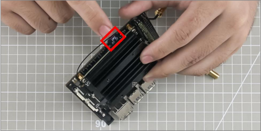
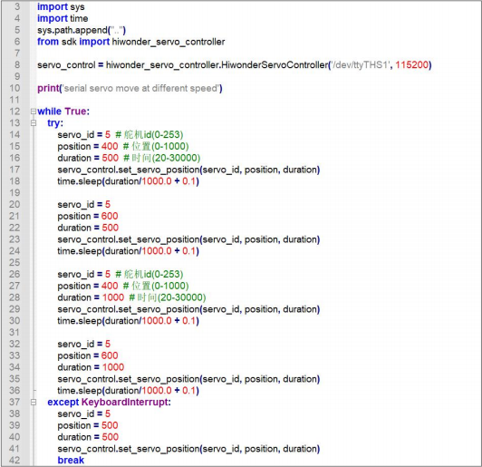
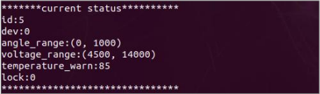

# 5. Jetson Nano Expansion Board

## 5.1 Introduction to Jetson Nano Expansion Board

### 5.1.1 Expansion Board Ports


### 5.1.2 Ports for Electronic Module

<table>
<colgroup>
<col style="width: 28%" />
<col style="width: 71%" />
</colgroup>
<tbody>
<tr>
<td>
<p><strong>Port</strong></p>
</td>
<td>
<p><strong>Function</strong></p>
</td>
</tr>
<tr>
<td>
<p>Power adapter port</p>
</td>
<td>
<p>It can connect to 12.6V 2A power adapter to supply power</p>
</td>
</tr>
<tr>
<td>
<p>Serial bus servo port</p>
</td>
<td>
<p>It can connect to and drive serial bus servo as well as read its status</p>
</td>
</tr>
<tr>
<td>
<p>Power port</p>
</td>
<td>
<p>“+” connects to positive electrode, and “-” connects to negative electrode</p>
</td>
</tr>
<tr>
<td>
<p>PWM servo port</p>
</td>
<td>
<p>It can connect to and drive the PWM servo</p>
</td>
</tr>
<tr>
<td>
<p>Power switch</p>
</td>
<td>
<p>Turn on/ off the device</p>
</td>
</tr>
<tr>
<td>
<p>Buzzer</p>
</td>
<td>
<p>It can make sound through programming</p>
</td>
</tr>
<tr>
<td>
<p>KEY1 、KEY2</p>
</td>
<td>
<p>Customize function</p>
</td>
</tr>
<tr>
<td>
<p>Serial port</p>
</td>
<td rowspan="4">
<p>For module expansion</p>
</td>
</tr>
<tr>
<td>
<p>5V/3.3V power supply port</p>
</td>
</tr>
<tr>
<td>
<p>GPIO port</p>
</td>
</tr>
<tr>
<td>
<p>IIC port</p>
</td>
</tr>
</tbody>
</table>

## 5.2 Expansion Board Installation

### 5.2.1 Accessory List

Before installing the expansion board, please prepare the following staffs.

|                    Name                    | Quantity |                Name                 | Quantity |
| :----------------------------------------: | :------: | :---------------------------------: | :------: |
|                Jetson Nano                 |    1     |     Jetson Nano expansion board     |    1     |
|      Dual-pass copper column/ M2.5*12      |    4     | Single-pass copper column/ M2.5*8+6 |    4     |
|                 heat sink                  |    1     |        Wireless network card        |    1     |
|                  antenna                   |    2     |               SD card               |    1     |
| Phillips round head  machine screw/ M2.5*5 |    4     |             cooling fan             |    1     |
|      Phillips round head screw/ M3*10      |    4     |                                     |          |

### 5.2.2 Installation Instruction

1) Install the pillar column to the round hold as pictured. Firstly, pass the single-pass copper column from the back, then use dual-pass copper column to screw the single-pass copper column.


>[!Note]
>
>**Do not misplace these two kinds of copper columns. The single-pass copper column should be on the back, and dual-pass copper column on the front.**


2) Before installing the antenna adapter cable, remove the heat sink first.

Remove the screws circled in the picture, then open the locks on both sides of the slot outwards. After that, the heat sink can be removed.


3) Install the wireless network card into the slot as pictured, and fix it with screw.


4) Install the antenna adapter cable to the interface circled in the picture.


5) Put the heat sink back to the slot circled below, and fix it with screw.


6) Insert the SD card into the card slot.



7) Connect the female headers of Jetson Nano expansion board to the headers of the controller. Then fix the expansion board with the Phillips round head machine screw/ M2.5\*5.


8) Install the cooling fan on the heat sink, then fix the four corners, circled below, with Phillips round head screw/ /M3\*10.


9) Connect the wire of the fan to the interface as the picture shown.


## 5.3 Application Notice

### 5.3.1 Notice

1) When the expansion board is working, please don’t use screwdrivers or other metal conductive objects to touch the electronic components on the device.

2) When the expansion board is working and powered on, you mustn’t unplug the devices except USB and HDMI.

### 5.3.2 Wiring Diagram


| Port                                                         | Function                                                     |
| ------------------------------------------------------------ | ------------------------------------------------------------ |
|  | It can connect to power cable <br />**Note: “+”** connects to positive electrode i.e. red power cable, and “**-**” connects to negative electrode i.e. black power cable |
|  | The serial bus servos can connect to one of them.            |
|  | It can connect to PWM servo whose working voltage is DC 5V.<br />**Note:“-”** connects to the negative electrode of servo, “**5V**” connects to negative electrode, and “**S**” connects to the signal terminal. |
|  | This serial port can connect to the electronic modules with serial port communication<br />**Note:** “**TX**” is the interface for sending data, and “**RX**” is the interface for receiving data |
|  | GPIO ports are used to connect expanded sensors or modules.<br />**Note:**<br /> 1. the working voltage of the external sensors and modules must be DC 5V<br />The positive pole of the module and sensor should connect to “**5V**”, negative pole to **“GND”** and signal terminal to **“IO6”, “IO10”, “IO20”** and “**IO26**” |
|  | IIC port is used to connect sensors or modules with IIC communication. The interface type is 5264-4AW.<br />**Note:** you can connect to one of them |

## 5.4 Control LED

### 5.4.1 LED Location

There is a LED on Jetson Nano expansion board as pictured.


### 5.4.2 Program Logic

The level status of I/O pin determines LED to light up and go out. When the pin is at low level, LED will go out.

The source code of the program is stored in **/home/jetauto_ws/src/jetauto_example/scripts/jetauto_adapter_exam ple/led_demo.py**


### 5.4.3 Operation Steps

>[!Note]
>
>**The input command should be case sensitive, and the keywords can be complemented by “Tab” key.**

1) Start Jetson Nano robotic kit, then connect it to NoMachine.

2) Double click to open the command line terminal.

3) Input command “**cd jetauto_ws/src/jetauto_example/scripts/jetauto_adapter_example/**” and press Enter to enter the directory where the game files are stored.

```py
cd jetauto_ws/src/jetauto_example/scripts/jetauto_adapter_example/
```

4) Input command “**python3 led_demo.py**” and press Enter to run the game program.

```py
python3 led_demo.py
```

5) If you want to exit the program, you can press “**Ctrl+C**”

### 5.4.4 Program Outcome

After the game starts, LED will flash twice quickly, then light up once, and it will cycle in this mode.

## 5.5 Control Buzzer

### 5.5.1 Buzzer Location

There is a buzzer on Jetson Nano expansion board.


### 5.5.2 Program Logic

The level status of the corresponding pin determines the buzzer to make sound or not. When the pin is at high level, the buzzer will make sound. When it is at low level, it will not make sound.

The source code of the program is stored in

**/home/jetauto_ws/src/jetauto_example/scripts/jetauto_adapter_exam ple/buzzer_demo.py**


### 5.5.3 Operation Steps

The input command should be case sensitive, and the keywords can be complemented by “**Tab**” key.

1) Start Jetson Nano robot kit, and connect it to NoMachine

2) Click or press “**Ctrl+Alt+T**” to open command line terminal.

3) Input command “**cd jetauto_ws/src/jetauto_example/scripts/jetauto_adapter_example/**” and press Enter to enter the directory where the program file is stored.

```py
cd jetauto_ws/src/jetauto_example/scripts/jetauto_adapter_example/
```

4) Input command “**python3 buzzer_demo.py**” and press Enter to run the game program

```py
python3 buzzer_demo.py
```

5) If you want to exit this program, you can press “**Ctrl+C**” .

### 5.5.4 Program Outcome

After the game starts, the buzzer will keep making sound.

## 5.6 Control Key

### 5.6.1 Key Location

There are two keys on Jetson Nano expansion board as pictured.


### 5.6.2 Program Logic

The status of the key that is whether it is pressed or not can be acquired through reading the level status of I/O key. If the pin is at high level, the key is released. If the pin is at low level, the button is pressed.

The source code of this program is located in

**/home/jetauto_ws/src/jetauto_example/scripts/jetauto_adapter_exam ple/button_demo.py**


### 5.6.3 Operation Steps

The input command should be case sensitive, and the keywords can be complemented by “**Tab**” key.

(1\) Start Jetson Nano robot kit, and connect it to NoMachine

(2\) Click or press “**Ctrl+Alt+T**” to open command line terminal.

(3\) Input command “**cd jetauto_ws/src/jetauto_example/scripts/jetauto_adapter_example/**” and press Enter to enter the directory where the program file is stored.

```py
cd jetauto_ws/src/jetauto_example/scripts/jetauto_adapter_example/
```

(4\) Input command “**python3 button_demo.py**” and press Enter to run the game program

```py
python3 button_demo.py
```

(5\) If you want to exit this program, you can press “**Ctrl+C**” .

### 5.6.4 Program Outcome

After the game starts, the status of `key1` and `key2` will be printed on the command line terminal. `0` means that the key is pressed, and `1` means that the key is released.

Take `key1` for example. When you long press the key1, the number behind key1 will change from `1` to `0`. When you release the `key2`, the number will change from `0` to `1` .


## 5.7 Read Acceleration Sensor

### 5.7.1 MPU6050 Location

Jetson Nano expansion board comes with a MPU6050 as the picture shown.


### 5.7.2 Program Logic

Inertial Measurement Unit is a device used to measure three-axis attitude angle and acceleration. In general, IMU is installed on the center of gravity of the object to be measured.

IMU is mainly composed of acceleration sensor and gyroscope.

Acceleration sensor is used to detect the acceleration signal of the object on the three axes of carrier coordinate system. And gyroscope is used to detect angular signal of the carrier relative to the navigation coordinate system. After the signal is processed, the posture of the object can be obtained.

MPU6050, six- axis posture sensor, is a kind of the IMU sensors, which integrates three-axis MEMS acceleration sensor, three-axis MEMS gyroscope and an expandable DMP (Digital Motion Processor).

The source code of this program is stored in

**/home/jetauto_ws/src/jetauto_example/scripts/jetauto_adapter_exam ple/imu_demo.py**


### 5.7.3 Operation Steps

The input command should be case sensitive, and the keywords can be complemented by “**Tab**” key.

(1\) Start Jetson Nano robot kit, and connect it to NoMachine

(2\) Click or press “**Ctrl+Alt+T**” to open command line terminal.

(3\) Input command “**cd jetauto_ws/src/jetauto_example/scripts/jetauto_adapter_example/**” and press Enter to enter the directory where the program file is kept.

```py
cd jetauto_ws/src/jetauto_example/scripts/jetauto_adapter_example/
```

(4\) Input command “**python3 imu_demo.py**” and press Enter to run the game program.

```py
python3 imu_demo.py
```

(5\) If you want to exit this program, please press “**Ctrl+C**” .

### 5.7.4 Program Outcome

After the game starts, the status of MPU6050 will be printed on the command line terminal.


The meaning of the information printed is as follow.

(1\) `ax`, `ay`, `az`: they respectively refer to X-axis component, Y-axis component and Z-axis component of acceleration

(2\) `gx`, `gy`,` gz`: they respectively are X-axis, Y-axis and Z-axis components of the angular speed.

## 5.8 Control Single PWM Servo

### 5.8.1 Wiring

Connect the PWM servo to any PWM servo port on the Jetson Nano expansion board. Take LFD-01M servo for example.


>[!Note]
>
>**Please strictly distinguish the positive and negative electrode of the PWM servo. Red wire is the positive electrode, and brown wire is the negative electrode.**

### 5.8.2 Program Logic

The program will control PWM servo to rotate by sending the pulse signal.

Through sending the command containing position and time for rotation, PWM servo can be controlled to spend the set time rotating to the specific position.

The source code of this program is stored in

**/home/jetauto_ws/src/jetauto_example/scripts/jetauto_adapter_example/ pwm_servo/pwm_servo_demo.py**


Take `my_servo.set_position(position, duration)` for example. The meaning of the parameters in bracket is explained below.

The first parameter `position` refers to the position to which the servo rotates i.e. pulse width. Formula: pulse width = 11.1 x angle + 500 (only for reference)

The second parameter `duration` is the time for the servo rotation in millisecond.
### 5.8.3 Operation Steps

The input command should be case sensitive, and the keywords can be complemented by “**Tab**” key.

(1\) Start Jetson Nano robot kit, and connect it to NoMachine

(2\) Click or press “**Ctrl+Alt+T**” to open command line terminal.

(3\) Input command “**cd jetauto_ws/src/jetauto_example/scripts/jetauto_adapter_example/pwm_servo/**” and press Enter to enter the directory where the program file is kept.

```py
cd jetauto_ws/src/jetauto_example/scripts/jetauto_adapter_example/pwm_servo/
```

(4\) Input command “**python3 pwm_servo_demo.py**” and press Enter to run the game program.

```py
python3 pwm_servo_demo.py
```

(5\) If you want to exit this program, please press “**Ctrl+C**” .

### 5.8.4 Program Outcome

After the game starts, PWM servo will rotate in this rule.

(1\) spend 1s rotating to 72° (1300 pulse width)

(2\) spend 1s rotating to 108° (1700 pulse width)

Then, the PWM servo will cycle in this way. If you press “**Ctrl+C**”, the program will be exited and the PWM servo will restore to 90° (1500 pulse width), which takes 1s.

### 5.8.5 Function Extension

The default servo port in the program is NO.1 port. If you want to connect the PWM servo to NO.2 port, you need to modify the program.

(1) Double click to open the terminal.

(2) Input command “**rosed jetauto_example pwm_servo_demo.py**” and press Enter to open the program file.

```py
rosed jetauto_example pwm_servo_demo.py
```

(3) Locate to the following codes.


>[!Note]
>
>**You can input the corresponding line number, then press “Shift+G” key to move to the target line.**

(4) Press “**i**” key to enter the editing mode, then change “ **1**” as “**2**” .


(5) After modification, press “**Esc**” key, input “ **:wq**” and press Enter to save and exit.


(6) Lastly, restart the game according to the steps in “**[5.8.3 Operation Steps]()**” , then you can check servo performance.

## 5.9 Control PWM Servo Speed

### 5.9.1 Wiring

Connect the PWM servo to any PWM servo port on the Jetson Nano expansion board. Take LFD-01M servo for example.


>[!Note]
>
>**Please strictly distinguish the positive and negative electrode of the PWM servo. Red wire is the positive electrode, and brown wire is the negative electrode.**

### 5.9.2 Program Logic

The program will control PWM servo to rotate by sending the pulse signal.

Through sending the command containing position and time for rotation, PWM servo can be controlled to spend the set time rotating to the specific position. And it can change the rotation time but remain the rotation position, the rotation speed of the servo can be adjusted.

The source code of the program is stored in **/home/jetauto_ws/src/jetauto_example/scripts/jetauto_adapter_example/pwm_servo/pwm_servo_speed_demo.py**


Take `my_servo.set_position(position, duration)` for example. The meaning of the parameters in bracket is as follows.

The first parameter `position` refers to the position to which the servo rotates i.e. pulse width. Formula: pulse width = 11.1 x angle + 500 (only for reference)

The second parameter `duration` is the time for the servo rotation in millisecond.

### 5.9.3 Operation Steps

The input command should be case sensitive, and the keywords can be complemented by “**Tab**” key.

(1\) Start Jetson Nano robot kit, and connect it to NoMachine

(2\) Click or press “**Ctrl+Alt+T**” to open command line terminal.

(3\) Input command “**cd jetauto_ws/src/jetauto_example/scripts/jetauto_adapter_example/pwm_servo/**” and press Enter to enter the directory where the program file is kept.

```py
cd jetauto_ws/src/jetauto_example/scripts/jetauto_adapter_example/pwm_servo/
```

(4\) Input command “**python3 pwm_servo_speed_demo.py**” and press Enter to run the game program.

```py
python3 pwm_servo_speed_demo.py
```

(5\) If you want to exit this program, please press “**Ctrl+C**” .

### 5.9.4 Program Outcome

After the game starts, PWM servo will rotate in this rule.

(1\) spend 0.5s rotating to 72° (1300 pulse width), and the angular velocity is 144 degree/ second.

(2\) spend 0.5s rotating to 108° (1700 pulse width), and the angular velocity is 216 degree/ second.

(3\) spend 1s rotating to 72° (1300 pulse width), and the angular velocity is 72 degree/ second.

(4\) spend 1s rotating to 108° (1700 pulse width), and the angular velocity is 108 degree/ second.

Then, the PWM servo will cycle in this way. If you press “**Ctrl+C**”, the program will be exited and the PWM servo will restore to 90° (1500 pulse width), which takes 1s.

## 5.10 Control 2 PWM Servos

### 5.10.1 Wiring

Connect 2 PWM servos to any PWM servo port on the Jetson Nano expansion board. Take LFD-01M servo for example.


>[!Note]
>
>**Please strictly distinguish the positive and negative electrode of the PWM servo. Red wire is the positive electrode, and gray wire is the negative electrode.**

### 5.10.2 Program Logic

The program will send the pulse signal to control PWM servo to rotate.

And by setting the parameters of different servo ports, several servos can be controlled to rotate at the same time.

The source code of this program is stored in

**/home/jetauto_ws/src/jetauto_example/scripts/jetauto_adapter_example/pwm_servo/two_pwm_servo_demo.py**


Take `my_servo.set_position(position, duration)` for example. The meaning of the parameters in bracket is explained below.

The first parameter `position` refers to the position to which the servo rotates i.e. pulse width. Formula: pulse width = 11.1 x angle + 500 (only for reference)

The second parameter `duration` is the time for the servo rotation in millisecond.

### 5.10.3 Operation Steps

The input command should be case sensitive, and the keywords can be complemented by “**Tab**” key.

(1\) Start Jetson Nano robot kit, and connect it to NoMachine

(2\) Click or press “**Ctrl+Alt+T**” to open command line terminal.

(3\) Input command “**cd jetauto_ws/src/jetauto_example/scripts/jetauto_adapter_example/pwm_servo/**” and press Enter to enter the directory where the program file is kept.

```py
cd jetauto_ws/src/jetauto_example/scripts/jetauto_adapter_example/pwm_servo/
```

(4\) Input command “**python3 two_pwm_servo_demo.py**” and press Enter to run the game program.

```py
python3 two_pwm_servo_demo.py
```

(5\) If you want to exit this program, please press “**Ctrl+C**” .

### 5.10.4 Program Outcome

After the game starts, these two PWM servos will rotate in this rule.

(1) spend 1s rotating to 72° (1300 pulse width)

(2) spend 1s rotating to 108° (1700 pulse width)

Then, these two PWM servos will cycle in this way. If you press “**Ctrl+C**”, the program will be exited and the PWM servos will restore to 90° (1500 pulse width), which takes 1s.

## 5.11 Control Serial Interface

### 5.11.1 Serial Interface Communication Definition

It is easy to control one LED to light up and go out by setting its voltage.

But if you want to control hundreds of LEDs, it is annoying to set the LED voltage one by one in the program. To deal with this problem, the serial communication is launched.

Serial communication is a way to transfer data by bit between external devices and computers through data signal line, control line and ground line. As it can send large amount of data at one time, serial communication can handle various complicated cases of data transmission, which is similar to IIC and SPI communication.

Serial interface is also called serial communication interface. It is an expansion interface that adopts serial communication to send and receive data by bit.

### 5.11.2 Wiring

Connect the TX and RX interfaces on Jetson Nano expansion board together, as the below picture shown.


### 5.11.3 Program Logic

TX and RX communication interfaces will be employed in serial interface communication. And TX interface will send the data, and RX interface will receive the data. After connecting TX and RX interfaces together, the serial interface communication can be simulated, and the “serial interface” can send and receive data.

The source code of this program is located in

**/home/jetauto_ws/src/jetauto_example/scripts/jetauto_adapter_example/ serial_send_demo.py**


The source code of this program is located in

**/home/jetauto_ws/src/jetauto_example/scripts/jetauto_adapter_example/ serial_read_demo.py**


### 5.11.4 Operation Steps

The input command should be case sensitive, and the keywords can be complemented by “**Tab**” key.

(1\) Start Jetson Nano robot kit, and connect it to NoMachine

(2\) Click or press “**Ctrl+Alt+T**” to open command line terminal.

(3\) Input command “**cd jetauto_ws/src/jetauto_example/scripts/jetauto_adapter_example/**” and press Enter to enter the directory where the program file is kept.

```py
cd jetauto_ws/src/jetauto_example/scripts/jetauto_adapter_example/
```

(4\) Input command “**python3 serial_send_demo.py**” and press Enter to run the program to send the data through serial interface.

```py
python3 serial_send_demo.py
```

(5\) Then open a new terminal, and input command “**cd jetauto_ws/src/jetauto_example/scripts/jetauto_adapter_example/**” and press Enter.

(6\) Input command “**python3 serial_read_demo.py**” and press Enter to run the program to receive the data through serial interface.

```py
python3 serial_read_demo.py
```

(7\) If you want to exit this program, you can press “**Ctrl+C**” on the corresponding terminal.

### 5.11.5 Program Outcome

After the game starts, the terminal where the program “**serial_read_demo.py**” runs will print the characters received by the serial interface.


## 5.12 Control Serial Bus Servo

### 5.12.1 Wiring

Connect the serial bus servo to any serial bus servo port on the Jetson Nano expansion board. Take HTS-35H servo for example.


**Note: the servo wire adopts reverse plugging protection. Please don’t plug it violently.**

### 5.12.2 Program Logic

The program controls the serial bus servo to rotate to the specific position in the designated time by sending command containing servo ID, rotation

position (pulse width) and rotation time.

The source code of this program is stored in **/home/jetauto_ws/src/jetauto_example/scripts/jetauto_adapter_example/serial_servo/serial_servo_move_demo.py**


Take `servo_control.set_servo_position(servo_id, position, duration)` for example. The meaning of the parameters in the bracket is as follows.

The first parameter `servo_id` refers to the servo ID, and the servo ID in this program is `5` . And you can change the number based on the actual case.

The second parameter `position` stands for the position to which the servo rotates i.e. pulse width. Formula: pulse = 4. 17 x angle (only for reference)

The third parameter “**duration**” is the time taken for rotation in millisecond.

### 5.12.3 Set Servo ID

If you need to change the ID of the serial bus servo, you can follow the steps below.

(1\) Start Jetson Nano robot kit, and then connect it to NoMachine.

(2\) Double click to open the command line terminal.

(3\) Input command “**cd jetauto_ws/src/jetauto_example/scripts/jetauto_adapter_example/serial\_servo/**” and press Enter.

```py
cd jetauto_ws/src/jetauto_example/scripts/jetauto_adapter_example/serial_servo/
```

(4\) Input command “**python3 set_serial_servo_status.py**” and press Enter to run the game program.

```py
python3 set_serial_servo_status.py
```


(5\) Input “ 1” , and press Enter to modify the servo ID.


(6\) Input the current servo ID, and press Enter.


(7\) Input the new servo ID, and press Enter.


After modification, the servo status will be printed on the terminal. At this time, the servo ID is changed successfully.


(8\) Input `9` and press Enter to exit the program


### 5.12.4 Operation Steps

The input command should be case sensitive, and the keywords can be complemented by “**Tab**” key.

(1\) Start Jetson Nano robot kit, and connect it to NoMachine

(2\) Click to open command line terminal.

(3\) Input command “**cd jetauto_ws/src/jetauto_example/scripts/jetauto_adapter_example/serial\_servo/**” and press Enter to enter the directory where the program file is stored.

```py
cd jetauto_ws/src/jetauto_example/scripts/jetauto_adapter_example/serial_servo/
```

(4\) Input command “**python3 serial_servo_move_demo.py**” and press Enter to run the game program.

```py
python3 serial_servo_move_demo.py
```

(5\) If you want to exit this program, you can press “**Ctrl+C**” .

### 5.12.5 Program Outcome

After the game starts, the serial bus servo will move in this way.

(1\) Spend 0.5s rotating to 96° (400 pulse width)

(2\) Spend 0.5s rotating to 144° (600 pulse width)

Then, the servo will cycle this motion. When you press “**Ctrl+C**” , this program will exit and PWM servo will restore to 120° (500 pulse width), which takes 0.5s.

## 5.13 Adjust Serial Bus Servo Speed

### 5.13.1 Wiring

Connect the serial bus servo to any serial bus servo port on the Jetson Nano expansion board. Take HTS-35H servo for example.


>[!Note]
>
>**The servo wire adopts reverse plugging protection. Please don’t plug it violently.**

### 5.13.2 Program Logic

The program controls the serial bus servo to rotate to the specific position in the designated time by sending command containing servo ID, rotation position (pulse width) and rotation time. And the rotation speed of the servo can be adjusted by remaining the rotation position the same and changing the rotation time.

The source code of this program is stored in

**/home/jetauto_ws/src/jetauto_example/scripts/jetauto_adapter_example/serial_servo/serial_servo_speed_demo.py**



Take `servo_control.set_servo_position(servo_id, position, duration)` for example. The meaning of the parameters in the bracket is as follows.

The first parameter `servo_id` refers to the servo ID, and the servo ID in this program is `5`. And you can change the number based on the actual case.

The second parameter `position` stands for the position to which the servo rotates i.e. pulse width. Formula: pulse = 4. 17 x angle (only for reference)

The third parameter `duration` is the time taken for rotation in millisecond.

### 5.13.3 Set Servo ID

If you need to change the ID of the serial bus servo, you can follow the steps below.

(1\) Start Jetson Nano robot kit, and then connect it to NoMachine.

(2\) Double click to open the command line terminal.

(3\) Input command “**cd jetauto_ws/src/jetauto_example/scripts/jetauto_adapter_example/serial_servo/**” and press Enter to enter the directory where the program files are stored.

```py
cd jetauto_ws/src/jetauto_example/scripts/jetauto_adapter_example/serial_servo/
```

(4\) Input command “**python3 set_serial_servo_status.py**” and press Enter to run the game program.

```py
python3 set_serial_servo_status.py
```


(5\) Input “ **1**”, and press Enter to modify the servo ID.


(6\) Input the current servo ID, and press Enter.


(7\) Input the new servo ID, and press Enter.


After modification, the servo status will be printed on the terminal. At this time, the servo ID is changed successfully.


(8\) Input `9` and press Enter to exit the program


### **5.13.4 Operation Steps**

The input command should be case sensitive, and the keywords can be complemented by “**Tab**” key.

(1\) Start Jetson Nano robot kit, and connect it to NoMachine

(2\) Click to open command line terminal.

(3\) Input command **cd jetauto_ws/src/jetauto_example/scripts/jetauto_adapter_example/serial_servo/**” and press Enter to enter the directory where the program file is stored.

```py
cd jetauto_ws/src/jetauto_example/scripts/jetauto_adapter_example/serial_servo/
```

(4\) Input command “**python3 serial_servo_speed_demo.py**” and press Enter to run the game program.

```py
python3 serial_servo_speed_demo.py
```

(5\) If you want to exit this program, you can press “**Ctrl+C**” .

### 5.13.5 Program Outcome

After the game starts, the serial bus servo will move in this way.

(1\) Spend 0.5s rotating to 96° (400 pulse width), and the angular velocity is 192 degree/ second.

(2\) Spend 0.5s rotating to 144° (600 pulse width), and the angular velocity is 288 degree/ second.

(3\) Spend 1s rotating to 96° (400 pulse width), and the angular velocity is 96 degree/ second.

(4\) Spend 1s rotating to 144° (600 pulse width), and the angular velocity is 144 degree/ second.

Then, the servo will cycle this motion. You can press “**Ctrl+C**” to exit this program, and PWM servo will restore to 120° .

## 5.14 Read Serial Bus Servo Status

### 5.14.1 Wiring

Connect the serial bus servo to any serial bus servo port on the Jetson Nano expansion board. Take HTS-35H servo for example.


>[!Note]
>
>**The servo wire adopts reverse plugging protection. Please don’t plug it violently.**

### 5.14.2 Program Logic

The program will send command to read the servo status in real time, including servo ID, rotation position and supply voltage.

The source code of this program is stored in **/home/jetauto_ws/src/jetauto_example/scripts/jetauto_adapter_example/serial_servo/serial_servo_status.py**


### 5.14.3 Set Servo ID

If you need to change the ID of the serial bus servo, you can follow the steps below.

(1\) Start Jetson Nano robot kit, and then connect it to NoMachine.

(2\) Double click to open the command line terminal.

(3\) Input command “**cd jetauto_ws/src/jetauto_example/scripts/jetauto_adapter_example/serial_servo/**” and press Enter to enter the directory where the program files are stored.

```py
cd jetauto_ws/src/jetauto_example/scripts/jetauto_adapter_example/serial_servo/
```

(4\) Input command “**python3 set_serial_servo_status.py**” and press Enter to run the game program.

```py
python3 set_serial_servo_status.py
```


(5\) Input “ **1**”, and press Enter to modify the servo ID.


(6\) Input the current servo ID, and press Enter.


(7\) Input the new servo ID, and press Enter.


After modification, the servo status will be printed on the terminal. At this time, the servo ID is changed successfully.



(8\) Input `9` and press Enter to exit the program


### 5.14.4 Operation Steps

The input command should be case sensitive, and the keywords can be complemented by “**Tab**” key.

(1\) Start Jetson Nano robot kit, and connect it to NoMachine

(2\) Click to open command line terminal.

(3\) Input command “**cd jetauto_ws/src/jetauto_example/scripts/jetauto_adapter_example/serial_servo/**” and press Enter to enter the directory where the program file is stored.

```py
cd jetauto_ws/src/jetauto_example/scripts/jetauto_adapter_example/serial_servo/
```

(4\) Input command “**python3 serial_servo_status.py**” and press Enter to run the game program.

```py
python3 serial_servo_status.py
```

(5\) If you want to exit this program, you can press “**Ctrl+C**” .

### 5.14.5 Program Outcome

After the game starts, the serial bus servo will move in this way.


The following information will be printed.

(1\) `id`: servo ID

(2\) `pos`: the current position of the servo

(3\) `dev`: deviation

(4\) `angle_range`: rotation range

(5\) `voltage_range`: voltage range

(6\) `temperature_warn`: threshold of temperature alarm

(7\) `temperature`: servo temperature

(8\) `vin`: voltage

(9\) `Lock`: load or unload reading

## 5.15 Battery Voltage Detection

### 5.15.1 Wiring

Connect the serial bus servo to any serial bus servo port on the Jetson Nano expansion board. Take HTS-35H servo for example.


>[!Note]
>
>**The servo wire adopts reverse plugging protection. Please don’t plug it violently.**

### 5.15.2 Program Logic

The program can read the servo voltage to get the battery voltage by sending the corresponding command.

The source code of this program is stored in

**/home/jetauto_ws/src/jetauto_example/scripts/jetauto_adapter_example/ serial_servo/serial_servo_voltage.py**


### 5.15.3 Set Servo ID

If you need to change the ID of the serial bus servo, you can follow the steps below.

(1\) Start Jetson Nano robot kit, and then connect it to NoMachine.

(2) Double clickto open the command line terminal.

(3\) Input command “**cd jetauto_ws/src/jetauto_example/scripts/jetauto_adapter_example/serial_ servo/**” and press Enter to enter the directory where the program files are stored.

```py
cd jetauto_ws/src/jetauto_example/scripts/jetauto_adapter_example/serial_servo/
```

(4\) Input command “**python3 set_serial_servo_status.py**” and press Enter to run the game program.

```py
python3 set_serial_servo_status.py
```


(5\) Input “ **1**”, and press Enter to modify the servo ID.


(6\) Input the current servo ID, and press Enter.


(7\) Input the new servo ID, and press Enter.


After modification, the servo status will be printed on the terminal. At this time, the servo ID is changed successfully.


(8\) Input `9` and press Enter to exit the program


### 5.15.4 Operation Steps

The input command should be case sensitive, and the keywords can be complemented by “**Tab**” key.

(1\) Start Jetson Nano robot kit, and connect it to NoMachine

(2\) Click to open command line terminal.

(3\) Input command “**cd jetauto_ws/src/jetauto_example/scripts/jetauto_adapter_example/serial_servo/**” and press Enter to enter the directory where the program file is stored.

```py
cd jetauto_ws/src/jetauto_example/scripts/jetauto_adapter_example/serial_servo/
```

(4\) Input command “**python3 serial_servo_voltage.py**” and press Enter to run the game program.

```py
python3 serial_servo_voltage.py
```

(5\) If you want to exit this program, you can press “**Ctrl+C**” .

### 5.15.5 Program Outcome

After the game starts, the battery voltage will be printed on the terminal.


